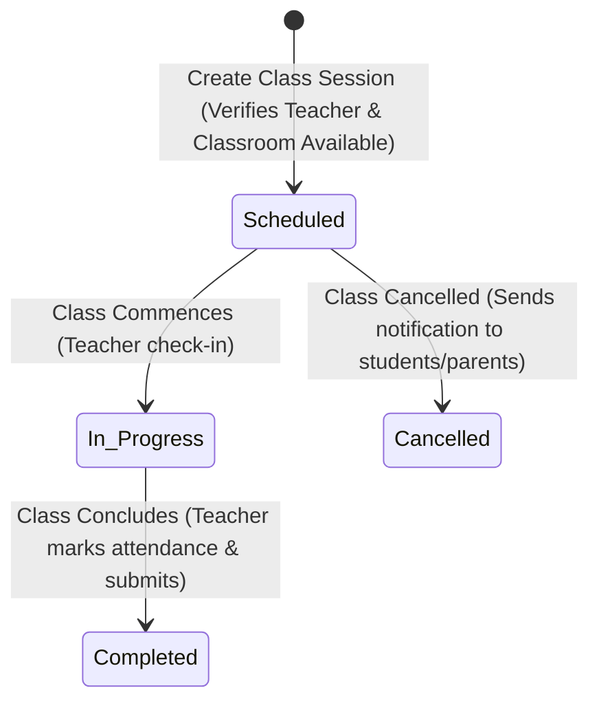
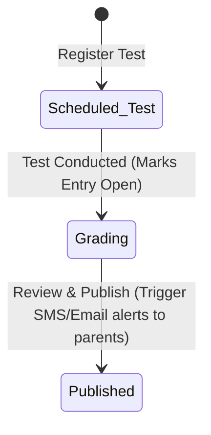

# Coaching Institute Management — Verity Capability Design

| | |
|---|---|
| **Client profile** | Single-location or multi-branch test-preparation and tutoring coaching institute. Manages students, batches, teachers, class scheduling, attendance, fee collection, test marks, study material, and parent communications. |
| **Document status** | **DEMONSTRATED / NOT YET BUILT** — this is a coaching capability design on top of the shipped platform. No `verity.capability.coaching` implementation exists until there is code in `src/server/capabilities/coaching/`, additive schema/migrations, registry activation, and passing tests. |
| **Proposed capability id** | `verity.capability.coaching` |
| **Proposed pack framing** | None. One purpose-built reusable capability, not an industry pack. |
| **Platform state at 2026-09-01 update** | Foundation frozen at 2026-08-24 milestone (`implementation/PLATFORM-FREEZE.md`). Shipped capabilities now include Location, Asset, Evidence, Scheduling, Approval, Dine-in, and Plywood. No coaching capability exists yet. |

### 0.1 Architecture update from the last 3-4 days of commits

- **Current:** this remains a design-only client capability. There is no `src/server/capabilities/coaching/` implementation.
- **Architecture carried forward:** coaching should be built as capability-private schema/code, registered through the capability registry, with command/query surfaces and workspace contributions. Recent client work reinforces this composition model rather than creating a school/ERP platform layer.
- **UI carried forward:** use the current semantic token and accent-driven glass system, but attendance grids, marks tables, fee ledgers, receipt print views, and parent/student data surfaces must remain dense and legible.
- **Boundary unchanged:** no LMS, online test platform, payment gateway, biometric integration, or franchise/multi-brand product pack is implied by the recent plywood/dine-in work.

---

## 1. Client requirements (as received)

A coaching institute management system covering:

1. **Students & Batches**
   - Student profiles (enrolment details, parent contacts, batch history).
   - Batch management (courses, subjects, active batches, student allocations).
2. **Teachers & Schedules**
   - Teacher master (specialisations, availability, assigned batches).
   - Class schedules / timetables (recurring class slots, room allocation).
3. **Attendance**
   - Student attendance tracking per class session.
   - Absentees reporting and instant alert triggers.
4. **Fees & Payments**
   - Fee structures (course fees, discount categories, instalment schedules).
   - Payment collections, receipts generation, and outstanding balance tracking.
5. **Tests & Marks**
   - Test scheduling (offline/online tests, test parameters, max marks).
   - Marks entry (per subject, per student) and performance analysis.
6. **Study Material**
   - Centralised document uploads (notes, assignment sheets, practice papers).
   - Batch-specific material sharing and access controls.
7. **Parent Communication**
   - Attendance status, test marks, and fee due alerts sent to registered parent channels.
   - Communication logs.
8. **Reports**
   - Revenue reports, collection updates, batch-wise performance trends, teacher engagement statistics, and attendance patterns.

### Derived operational requirements (made explicit so scope is testable)
- **Instalments & Due Dates**: Fees are split into custom instalment configurations (e.g. monthly, quarterly, lumpsum). Outstanding balances are dynamically recalculated.
- **Double-booking Prevention**: A classroom (Location) and a Teacher (Resource) cannot be booked for two overlapping classes simultaneously. Scheduling controls this automatically.
- **Role-based Redaction**: Students must not see other students' marks or contact details. Parents see only their own children's performance and fee status.
- **Immutability of Marks & Attendance**: Once attendance or test marks are submitted, edits require manager/admin overrides with dated audit comments to prevent arbitrary grade adjustments.

### Explicitly not requested and therefore out of scope for v1
- Fully-featured LMS (no live video streaming, no interactive video quizzes, no online compilers).
- Direct payment gateway API integration (fees recorded manual-and-print, receipt issued).
- Advanced automated biometric attendance hardware syncing (attendance is checked by teacher or desk on a screen; device integration is deferred).
- Multi-brand franchises (tenancy isolation remains absolute; branches under a single brand map to Organizations).

---

## 2. Authority position

### 2.1 The decision path this document follows
`implementation/PLATFORM-FREEZE.md`: *can existing Verity primitives support it? If yes, build the capability; if no, smallest additive extension justified in writing.*
- **Classrooms** map to the platform's `Location` primitive.
- **Teachers** map to the platform's `Resource` primitive (backed by a `Party` record).
- **Study Materials / Notes PDFs** map to the platform's `Evidence` / `StoredFile` primitive (checksum-frozen files).
- **Class Sessions, Test Runs, and Fee Instalments** map to the platform's `Work` primitive (lifecycles of execution).
- **Students and Parents** map to capability-owned entities that link to `Party` and `User` records for secure login and portal access.
- No core platform changes are proposed; all models are capability-private database extensions.

### 2.2 Scope boundaries
- **GOV-SCO-006** (retail and payment terminals): Payment collection is **record-and-print**. No card-terminal integration, no payment gateway checkout widget.
- **PLATFORM-FREEZE**: No generic school/ERP engine is added to platform core. All models are private to `verity.capability.coaching`.

### 2.3 Terminology compliance
All names respect GOV-TER-001..017.
- **`Location`** is used for Classrooms and Branches.
- **`Resource`** is used for Teachers.
- **`Work`** instances are `ClassSession` and `TestRun`.
- **`Student`**, **`Parent`**, **`Batch`**, and **`Enrollment`** are capability-owned entities.
- **`Evidence`** is used for verified test papers or submitted assignments.

---

## 3. Platform fit — requirement → primitive map

| Coaching requirement | Existing primitive that carries it | Status of primitive |
|---|---|---|
| Tenant isolation | Tenant + RLS via `withTenant()`; fail-closed GUC | BUILT / PROVEN |
| Staff, Student, and Parent logins | Supabase Auth + Party/User/TenantMembership | BUILT / PROVEN |
| Classrooms / Labs | `Location` primitive (Place + Address) | BUILT / PROVEN |
| Class Scheduling / Timetables | Scheduling: Teacher Resource + classroom Location + Booking | BUILT / PROVEN |
| Lecture Notes, Assignment PDFs | `Evidence` (checksum-frozen `StoredFile` references) | BUILT / PROVEN |
| Test Sessions, Class Sessions | `Work` primitive (StateCategory lifecycles) | BUILT / PROVEN |
| Attendance, Fee Ledgers, Marks | Capability-owned append-only tables | DEMONSTRATED |
| Parent Alerts (Absences, Low Grades) | Notification substrate (`notify()`, templates, suppressions) | BUILT |
| Performance dashboards | Server components + chart primitives (`StairFigure`, `BarStrip`), workspace contributions | BUILT |

---

## 4. Tenant & organization topology

```
Tenant: "Apex Academy"                    timeZone: Asia/Kolkata (configurable at provisioning)
└── Organization: "Kailash Colony Branch"  (Branch unit)
    ├── Location: "Room 101 - Smart Class" (Operational classroom Location)
    └── Location: "Room 102 - Physics Lab" (Operational classroom Location)
```

---

## 5. Staff identity, roles & permissions

### 5.1 Roles
Closed set of roles for the coaching capability:
- `Owner / Administrator`: Full administrative control, fee structures, financial reports, marks/attendance overrides.
- `Teacher`: Manage assigned classes, mark class-wise attendance, create tests, enter marks, upload study materials.
- `Student`: Read own class timetable, view own attendance/marks, download shared study material.
- `Parent`: Read linked student's timetable, view attendance logs, view marks reports, view fee dues, and pay histories.
- `Front Desk Coordinator`: Enroll students, create batches, generate class schedules, collect payments.

### 5.2 Permission matrix
Verbs from the closed set (PLA-AUT-003); actions ride `ActionExecute`. All grants at Tenant level.

| Entity | Read | Create | Edit | Delete | ActionExecute |
|---|---|---|---|---|---|
| `verity.coaching.batch` | All | Admin, FrontDesk | Admin, FrontDesk | — | allocate-student (Admin) |
| `verity.coaching.student` | Admin, Teacher, FrontDesk | Admin, FrontDesk | Admin, FrontDesk | — | set-status (Admin) |
| `verity.coaching.attendance` | All† | Teacher, FrontDesk | Teacher, Admin | — | lock-attendance (Admin) |
| `verity.coaching.fee_payment` | Admin, FrontDesk, Parent‡ | FrontDesk | — | — | generate-receipt (FrontDesk) |
| `verity.coaching.test` | All | Teacher, Admin | Teacher, Admin | — | publish-results (Admin, Teacher) |
| `verity.coaching.marks` | All† | Teacher, Admin | Teacher, Admin | — | override-marks (Admin) |
| `verity.coaching.study_material` | All | Teacher, Admin | Teacher, Admin | — | share-with-batch (Teacher) |

- † *Students and Parents can only read their own marks and attendance logs via Layer-2 RLS filters.*
- ‡ *Parents can only read the fee data linked to their student's ID.*

---

## 6. Domain model — modules and entities

Every model carries the base-entity shape (`id, tenantId, createdAt, updatedAt, version, customFields`) and is protected by RLS. Money is stored in paise (`pricePaise`).

### Module M1 — Students & Batches (`verity.coaching.student`, `verity.coaching.batch`, `verity.coaching.enrollment`)
- **Student**: `partyId FK` (links to global Party), `parentId FK?` (references Parent entity), `rollNumber String`, `enrolmentDate Date`, `active Boolean @default(true)`.
- **Parent**: `partyId FK` (links to global Party), `relationshipType` (`father | mother | guardian`), `alertChannel` (`email | sms`).
- **Batch**: `name`, `courseCode String`, `startDate Date`, `endDate Date`, `active Boolean @default(true)`.
- **Enrollment**: `studentId FK`, `batchId FK`, `enrollmentStatus` (`active | suspended | completed`).

### Module M2 — Teachers & Scheduling (`verity.coaching.teacher`, `verity.coaching.class_session`)
- **Teacher**: `partyId FK` (links to global Party), `specialisations Json` (list of subjects), `active Boolean @default(true)`.
- **ClassSession**: 
  - `batchId FK`,
  - `teacherResourceId FK` (Resource primitive reference),
  - `classroomLocationId FK` (Location primitive reference),
  - `bookingId FK` (Scheduling Booking reference),
  - `subject String`,
  - `startsAt DateTime`,
  - `endsAt DateTime`,
  - `state` (`scheduled | in_progress | completed | cancelled`).

### Module M3 — Attendance (`verity.coaching.attendance`)
- **Attendance**:
  - `classSessionId FK`,
  - `studentId FK`,
  - `status` (`present | absent | late`),
  - `reason String?`,
  - `markedByUserId FK`,
  - `markedAt DateTime`.
  - Unique index on `(classSessionId, studentId)`.

### Module M4 — Fees & Collection (`verity.coaching.fee_structure`, `verity.coaching.fee_instalment`, `verity.coaching.fee_payment`)
- **FeeStructure**: `name`, `totalAmountPaise Int`, `instalmentCount Int`, `active Boolean @default(true)`.
- **FeeInstalment**: `studentId FK`, `batchId FK`, `instalmentIndex Int`, `dueDate Date`, `amountPaise Int`, `outstandingPaise Int`, `state` (`unpaid | partial | paid`).
- **FeePayment**: `studentId FK`, `instalmentId FK?`, `amountPaidPaise Int`, `paymentMethod` (`bank | upi | cash`), `txnReference String?`, `collectedByUserId FK`, `collectedAt DateTime`.

### Module M5 — Tests & Marks (`verity.coaching.test`, `verity.coaching.test_marks`)
- **Test**: `batchId FK`, `name`, `subject String`, `maxMarks Int`, `testDate Date`, `state` (`scheduled | grading | published | cancelled`).
- **TestMarks**:
  - `testId FK`,
  - `studentId FK`,
  - `marksObtained Int` (stored as integer tenths, e.g. 855 representing 85.5 to allow decimal marks),
  - `gradedByUserId FK`,
  - `absent Boolean @default(false)`,
  - `feedback String?`.
  - Unique index on `(testId, studentId)`.

### Module M6 — Study Material (`verity.coaching.study_material`)
- **StudyMaterial**:
  - `title String`,
  - `description String?`,
  - `batchId FK?` (null = public or all batches),
  - `subject String`,
  - `storedFileId FK` (Evidence/StoredFile reference),
  - `uploadedByUserId FK`.

---

## 7. Operational flows & state transitions

### 7.1 Timetable Scheduling flow
Prevents classroom and teacher double-bookings:


### 7.2 Grading & Publishing flow
Attendance and marks tracking transition loop:


---

## 8. UI/UX layout, pages & workspaces contribution

### 8.1 Workspaces
1. **Admin / Owner Dashboard**
   - KPI Strip: Student Count | Fee Collection (MTD) | Outstanding Fees | Average Attendance Rate | Active Classes | Material Downloads.
   - Timetable Overview: Live grid showing classroom allocations and occupied blocks.
   - Outstanding Fee Ledger: Filterable list of students with delinquent dues and easy options to send reminder alerts.
2. **Teacher Workspace**
   - My Classes: Quick check-in card to view past and upcoming classes.
   - Attendance Pad: Simple student roll-call grid with "Present / Absent / Late" toggles.
   - Gradebook: Inline editable spreadsheet UI for quick marks entry per test.
   - Notes Repository: Direct upload file selector to link PDFs/Docs to active batches.
3. **Student & Parent Portal**
   - Calendar Panel: Weekly schedule with links to join class discussions/downloads.
   - Performance Hub: Progress charts mapping test scores against batch averages.
   - Attendance Wheel: Interactive donut chart displaying current attendance percentage.
   - Fee Drawer: Clear breakdown of next instalments, due dates, and past transaction receipts.

---

## 9. Open gaps/decision points

> [!NOTE]
> **Biometric Attendance Syncing**
> Biometric terminal integrations (RFID/Fingerprint devices) are excluded from the scope of v1. The system utilizes screen-based attendance logging by teachers. When hardware integration is required, a standard webhook-endpoint interface can be defined to feed biometric logs into the `verity.coaching.attendance` ledger.
