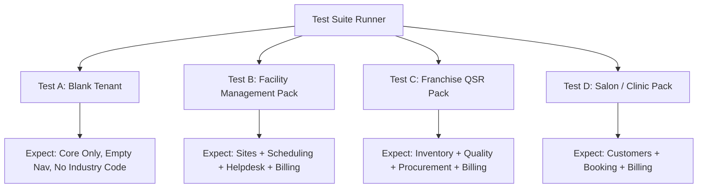

# Product Readiness Audit: Verity Composable Operating Platform

This audit evaluates the Verity codebase against the **Composable Operating Platform** vision. It separates engineering infrastructure from operational product completeness to show what is genuinely ready and what remains before a real business can run on Verity.

---

## 1. Product Maturity Dashboard

| Metric / Dimension | Assessment | Status | Definition / Milestone Target |
| :--- | :---: | :---: | :--- |
| **Platform Foundation** | 🟢 Strong | **90%** | Multi-tenancy, RLS, static registry, event bus core. |
| **Composable Engine** | 🟡 Emerging | **55%** | Dependency resolution and nav resolution are live; workflow composition is hardcoded. |
| **Business Workflows** | 🔴 Incomplete | **30%** | CRUD actions exist but lack business logic/lifecycle validation. |
| **Role-Based UX** | 🔴 Incomplete | **25%** | Owner panels are live; Worker/Deskless interfaces are missing or mockups. |
| **Customer Experience** | 🔴 Incomplete | **15%** | B2C portals (/book and /menu) are not implemented. |
| **Production Readiness** | 🔴 Not Ready | **10%** | Lacks monitoring, backup verification, and data import tools. |

---

## 2. Module Operational Gap Matrix

This matrix audits every module across 11 dimensions. We do not treat database models or basic CRUD pages as evidence of a complete capability.

*   **Legend:** 🟢 Complete (Production Ready) | 🟡 Basic (Prototype/CRUD only) | 🔴 Missing/Incomplete | ➖ Not Applicable

| Module | Data Model | CRUD Actions | Business Workflow | Role UX (Owner/Mgr) | Mobile/Worker UX | B2C Portal | Integrations | Reports & Analytics | Exception Handling | Audit Logs | Tenant Settings |
| :--- | :---: | :---: | :---: | :---: | :---: | :---: | :---: | :---: | :---: | :---: | :---: |
| **Core** | 🟢 | 🟢 | 🟢 | 🟡 | 🔴 | ➖ | 🟡 | 🔴 | 🔴 | 🟢 | 🟡 |
| **Inventory** | 🟢 | 🟢 | 🔴 | 🟡 | 🔴 | ➖ | 🔴 | 🔴 | 🔴 | 🟡 | 🔴 |
| **Quality** | 🟡 | 🟡 | 🔴 | 🔴 | 🔴 | ➖ | 🔴 | 🔴 | 🔴 | 🟡 | 🔴 |
| **Procurement**| 🟡 | 🟡 | 🔴 | 🔴 | 🔴 | ➖ | 🔴 | 🔴 | 🔴 | 🟡 | 🔴 |
| **Sales** | 🟡 | 🟡 | 🔴 | 🔴 | 🔴 | ➖ | 🔴 | 🔴 | 🔴 | 🟡 | 🔴 |
| **CRM** | 🟡 | 🟡 | 🔴 | 🔴 | 🔴 | 🔴 | 🔴 | 🔴 | 🔴 | 🟡 | 🔴 |
| **HR** | 🟡 | 🟡 | 🔴 | 🟡 | 🔴 | ➖ | 🔴 | 🔴 | 🔴 | 🟡 | 🔴 |
| **Finance** | 🔴 | 🔴 | 🔴 | 🔴 | 🔴 | ➖ | 🔴 | 🔴 | 🔴 | 🔴 | 🔴 |
| **Projects** | 🟡 | 🟡 | 🔴 | 🟡 | 🔴 | ➖ | 🔴 | 🔴 | 🔴 | 🟡 | 🔴 |
| **Assets** | 🟡 | 🟡 | 🔴 | 🔴 | 🔴 | ➖ | 🔴 | 🔴 | 🔴 | 🟡 | 🔴 |
| **Helpdesk** | 🟡 | 🟡 | 🟡 | 🟡 | 🔴 | 🔴 | 🔴 | 🔴 | 🔴 | 🟡 | 🔴 |
| **Sites** | 🟢 | 🟢 | 🟡 | 🟡 | 🔴 | ➖ | 🔴 | 🔴 | 🔴 | 🟡 | 🔴 |
| **Scheduling** | 🟡 | 🟡 | 🔴 | 🟡 | 🟡 | ➖ | 🔴 | 🔴 | 🔴 | 🟡 | 🔴 |
| **Billing** | 🟡 | 🟡 | 🟡 | 🟡 | 🔴 | ➖ | 🟡 | 🔴 | 🔴 | 🟢 | 🔴 |
| **Booking** | 🟡 | 🟡 | 🟡 | 🟡 | 🔴 | 🔴 | 🔴 | 🔴 | 🔴 | 🟢 | 🔴 |

---

## 3. Deep-Dive Module Gaps

### 📅 Booking Module
*   **What we have:** Flat `Appointment` table, basic day/week view in Owner Shell, and slot reservation database actions.
*   **What is missing (Product Gaps):**
    *   *Roster Rules:* Break schedule mapping, provider working hours, time-slot buffers (e.g. 15m cleaning time between appointments).
    *   *Operational Workflows:* Cancellation policies, no-show marking, customer reminders (WhatsApp/Email), rescheduling gates, and customer history cards.

### 📦 Inventory Module
*   **What we have:** `Product` schema (renamed from `ItemMaster`), zones, racks, bin-level ledger balances, and basic stock ledger logs.
*   **What is missing (Product Gaps):**
    *   *Workflows:* Cycle counting/stock-taking (reconciliation of physical vs. database counts), automated low-stock reorder triggers, bin transfer approval stages, and printing barcode labels.

### 💼 HR & Scheduling
*   **What we have:** Shift schema, user profile linking, and simple roster assignments.
*   **What is missing (Product Gaps):**
    *   *Workflows:* Shift swaps requests/approvals, overtime calculation, clock-in geo-fencing or IP checking, and leave/absence mapping.

### 💳 Billing & Invoicing
*   **What we have:** Subscription billing actions, automated period invoices, and draft invoice creations.
*   **What is missing (Product Gaps):**
    *   *Workflows:* Tax engine calculation (GST/VAT mapping), payment gateway links (Stripe/UPI integration), discount code/promotional engines, and dynamic retry rules for failed card transactions.

---

## 4. Platform Engine & Control Plane Gaps

### A. Dynamic Module Composition
*   **Current State:** Modules are statically registered in `registry.ts`.
*   **The Gap:** Toggling a module in HQ turns on the entitlement row, but there is no mechanism to verify dependencies. If we disable `CRM` but keep `Booking` active, queries fail. We need a strict **dependency resolution engine** that enforces requirements at the boundary.

### B. The Workflow Engine
*   **Current State:** Event-driven reactions in `reactions.ts` are hardcoded.
*   **The Gap:** A client cannot configure their own milestone pathways (e.g. "when appointment completes $\rightarrow$ do not draft bill, send feedback first"). Workflows must be composed dynamically using system templates rather than hardcoded event listener chains.

---

## 5. The Composable System Test Protocol

To prove Verity is truly a composable operating platform, we will implement four automated test configurations. If these fail to provision or throw compile-time/runtime errors, the platform is not complete.



---

## 6. Real-World Usability Test Protocols

We will establish three observation protocols to determine if our interface designs succeed before release:

### 1. The Manager Test
*   *Task:* "Create a new employee profile, assign them to a Tuesday morning shift, register a new retail product, create a sales order, and invoice it."
*   *Success Metric:* Completed in under 5 minutes without opening documentation or console logs.

### 2. The Deskless Worker Test
*   *Task:* "You are a floor technician. Log in, clock into your shift, see your first assigned maintenance ticket, check the inspection sheet, mark it complete, and upload a photo of the completed asset."
*   *Success Metric:* Interfaces are touch-screen friendly, loading in $<1.5\text{s}$, and showing only relevant buttons.

### 3. The B2C Customer Test
*   *Task:* "You are a client booking a service. Select a stylist, pick a 2:00 PM slot next Thursday, enter your name/phone, and submit."
*   *Success Metric:* Zero friction, mobile-optimized, and immediate confirmation receipt email.

---

## 7. The Roadmap to Release

Instead of a binary "Prototype $\rightarrow$ Launch" roadmap, Verity will roll out in three phases:

```text
[ Composable Platform Alpha ] ──> [ Verity Pilot (Beta) ] ──> [ Verity 1.0 (GA) ]
```

### Phase A: Composable Platform Alpha (Current Milestone Target)
*   **Objective:** Genuinely complete core modules and whitelabel portals.
*   **Acceptance Criteria:**
    *   Dynamic module activation/deactivation works with zero codebase hardcoding.
    *   The B2C Customer portals (`/c/[clientSlug]/book` and `/c/[clientSlug]/menu`) are fully operational.
    *   The Owner and Worker shells dynamically filter all views based on the active pack.

### Phase B: Verity Pilot
*   **Objective:** Deploy Verity to one live business (e.g. a local cafe or facility team) for actual daily operations.
*   **Acceptance Criteria:**
    *   Zero data loss over 30 consecutive operating days.
    *   Daily backups, performance tuning, and error alerts are configured and monitored.

### Phase C: Verity 1.0 (Public Launch)
*   **Objective:** Open the platform to public, self-serve tenants.
*   **Acceptance Criteria:**
    *   Tenants can register, accept agreements, pay invoices, and configure their operating pack completely self-serve in under 10 minutes.
