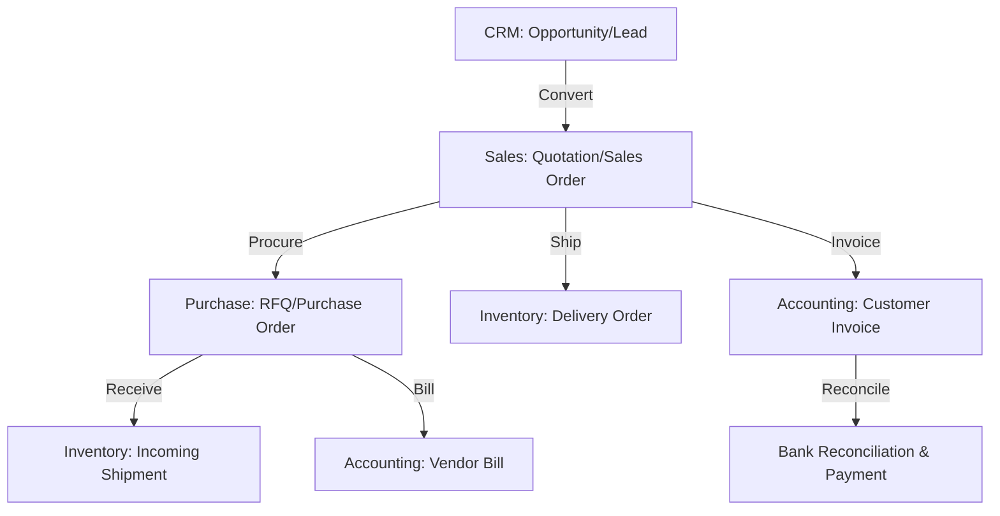

# Executive System Overview

## Purpose
The primary purpose of Odoo is to provide an integrated, modular Enterprise Resource Planning (ERP) and Customer Relationship Management (CRM) system. It acts as a single, central source of truth for all business operations, eliminating data silos and manual handoffs between department systems.

## Primary Business Flows
The system represents a sequence of interconnected processes that span multiple functional domains:

### 1. Lead-to-Opportunity (CRM)
- Capture prospective business relationships (Leads).
- Quality leads and transition them into Opportunities.
- Track negotiation stages, expected revenue, and success probability.

### 2. Quote-to-Cash (Sales, Inventory, Accounting)
- Generate a Quotation for a customer with specific products, quantities, prices, and taxes.
- Upon customer confirmation, transition the Quotation into a Sales Order.
- Automatically generate a Delivery Order in Inventory to reserve and ship products.
- Create a Customer Invoice based on either ordered or delivered quantities.
- Record customer payment and reconcile it with the invoice.

### 3. Procure-to-Pay (Purchase, Inventory, Accounting)
- Identify low-stock conditions or trigger purchase requirements from sales orders (Make to Order).
- Generate a Request for Quotation (RFQ) for vendors.
- Confirm the RFQ to create a Purchase Order.
- Generate an Incoming Shipment (Receipt) to receive goods into the warehouse.
- Generate a Vendor Bill upon receiving the invoice from the vendor.
- Process payment to the vendor and reconcile.

### 4. Collaborative Hub (Mail / Chatter)
- Every business document (Opportunity, Sales Order, Invoice) inherits collaborative abilities (chatter).
- Users can post internal notes, send emails to partners, log calls, and schedule tasks (activities) directly on the record.

## Target Actors and Roles
- **Sales Representative / Manager**: Manages leads, opportunities, quotations, and teams.
- **Inventory Clerk / Manager**: Manages warehouse operations, receipts, deliveries, and stock counts.
- **Billing Specialist / Accountant**: Manages customer invoices, vendor bills, payments, and journals.
- **System Administrator**: Manages system configuration, users, permissions, and automation rules.
- **Portal User**: Customers/vendors who log in to view their quotations, orders, and invoices.
