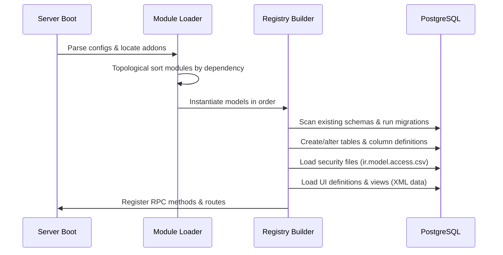

# Core Framework Architecture

## Modular Framework
Odoo is designed as a modular framework. It is composed of a core server engine (`odoo/`) and a set of independent modules (`addons/`). At database startup, Odoo loads these modules in topological order based on their dependency declarations (`depends` list in their `__manifest__.py`).

## Database Registry & Lifecycle
For each active database, Odoo compiles a dynamic **Registry** that maps Python class declarations to database tables and relationships.

### Registry Compilation Rules
1. **Dependency Sorting**: Modules are loaded in a strict tree order. A module cannot load until all its dependencies are compiled.
2. **Class Merging (`_inherit`)**: When multiple classes reference the same `_name` via `_inherit`, the framework combines them at runtime into a single model class in the registry. 
3. **Execution Context (`Environment`)**: All ORM operations are executed within an `Environment` (`env`). The environment is a lightweight object that carries:
   - `cr`: The active PostgreSQL database cursor.
   - `uid`: The ID of the user executing the operation (security contexts).
   - `context`: A dictionary containing localization (lang, timezone) and processing directives (e.g., `active_id`, `discard_cache`).

## Controller Routing and Web Server
Odoo includes a built-in WSGI-compliant web server built on top of **Werkzeug**. 

### Routing Mechanics
- Controllers are defined as subclasses of `odoo.http.Controller`.
- Action methods are decorated with `@odoo.http.route(route_path, type='http'|'json', auth='none'|'public'|'user'|'api')`.
- **Type Mapping**:
  - `json`: Receives and returns JSON-RPC 2.0 requests.
  - `http`: Receives standard HTTP query parameters or multi-part forms, and returns HTML strings or file downloads.
- **Authentication Handlers**:
  - `none`: Session-less route. Used for health checks or basic callback webhooks.
  - `public`: Access is granted to both signed-in users and anonymous visitors (portal/public user).
  - `user`: Requires a valid signed-in user session.
  - `api`: Authenticated using API tokens (OAuth or API Keys).
