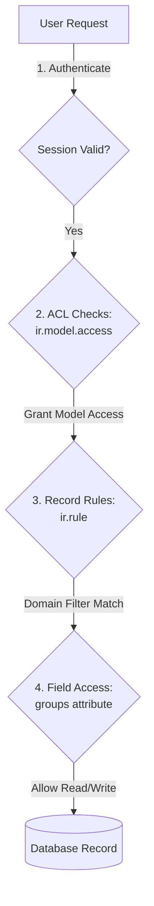

# Security and Access Control Model

Odoo implements a multi-tiered security model combining model-level permissions, record-level isolation, and field-level visibility constraints.



## 1. Model-Level Access Control (ACL)
Model access permissions are defined in CSV files (typically named `ir.model.access.csv` inside a module's `security/` directory).

### CSV Configuration Parameters
Each row contains:
- `id`: Unique XML identifier.
- `name`: Descriptive name of the access rule.
- `model_id:id`: Reference to the target model (e.g., `model_sale_order`).
- `group_id:id`: Reference to the security group (e.g., `base.group_user`). If left blank, it applies to *all* users.
- `perm_read`: Boolean (1=True, 0=False) for read access.
- `perm_write`: Boolean for write (edit) access.
- `perm_create`: Boolean for create access.
- `perm_unlink`: Boolean for unlink (delete) access.

> [!IMPORTANT]
> If a model does not have an explicit ACL entry granting permissions to a user's security groups, that user has zero access to the model by default (Closed Security Model).

## 2. Record-Level Rules (`ir.rule`)
Record Rules are database records that dynamically restrict which individual rows in a table a user can access, even if the user has model-level access.

### Key Attributes
- `model_id`: The model the rule applies to.
- `domain_force`: A Python domain expression evaluated at runtime to construct SQL `WHERE` clauses (e.g., `[('company_id', 'in', company_ids)]`).
- `groups`: Security groups this rule applies to. If empty, the rule is "global."
- `perm_read`, `perm_write`, `perm_create`, `perm_unlink`: Booleans determining which operations trigger the rule.

### Rule Evaluation Logic
- **Global Rules (no groups)**: Combined using `AND` operators. Every global rule on a model must pass.
- **Group Rules (linked to groups)**: Combined using `OR` operators. If a user is member of multiple groups with group rules, they pass if *any* of those rules pass.
- **Global vs Group combination**: The combined Group rules are merged with Global rules using `AND`.

## 3. Field-Level Restrictions
Fields can be restricted directly in Python using the `groups` parameter:
```python
margin = fields.Monetary(string="Margin", groups="sales_team.group_sale_manager")
```
- If a user is not a member of `sales_team.group_sale_manager`, the web client will automatically strip this field from views, and the ORM will raise an `AccessError` if the user attempts to read or write it.

## 4. User Groups and Privilege Inheritance
Groups are defined as `res.groups` records.
- **Inheritance (`implied_ids`)**: Groups can inherit privileges from other groups. For example, the group `Sales / Manager` implies the group `Sales / User`. Any user added to the Manager group automatically inherits all ACLs, Record Rules, and menu items available to the User group.
- **Base Groups**:
  - `base.group_portal`: Grants limited access to the portal interface for external customers.
  - `base.group_public`: Grants access to non-authenticated visitors.
  - `base.group_user`: The base "Internal User" group. All employee accounts belong to this group and inherit fundamental system access.
