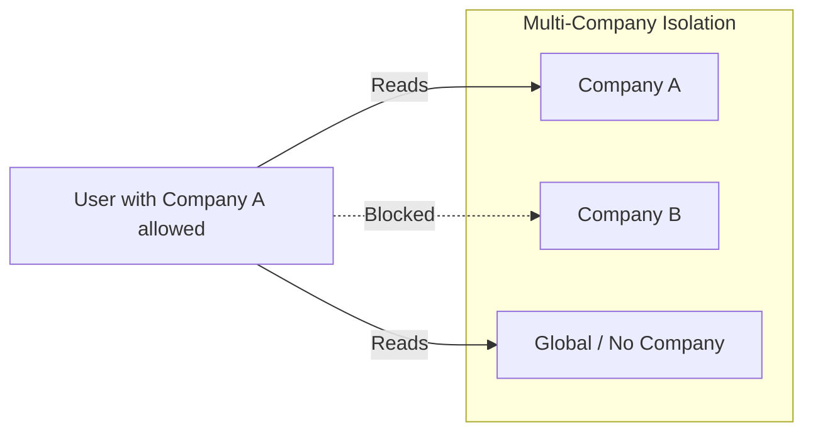

# Identity and Access Management

This document specifies Odoo's identity model, multi-company isolation patterns, user types, and authentication protocols.

## Multi-Company Partitioning
Odoo supports multi-company operations within a single database. This is managed via data partitioning rules rather than physical database separation.

### The `company_id` Separation Rule
- The base model of most business documents includes a `company_id` field (`Many2one` relation to `res.company`).
- **Isolation Rule**: A record with a specific `company_id` is only accessible to users who are currently logged into or authorized for that company.
- **Global Rule**: A record with `company_id = False` (null) is a global record, meaning it is shared and visible across all companies (e.g. standard product templates or universal currency definitions).

### User-Company Association
The `res.users` model defines two key fields:
- `company_id`: The current/active company of the user. This dictates the default company tagged on new records created by the user.
- `company_ids`: A list of all allowed companies the user is authorized to switch between.

## User Types
Users in the system fall into three mutually exclusive categories:

1. **Internal Users (Employees)**:
   - Granted full access to the backend management console.
   - Automatically added to the `base.group_user` security group.
   - Access to standard model lists, forms, search views, and wizards.
2. **Portal Users (Customers/Vendors)**:
   - Restructured access limited to the customer portal interface (`/my`).
   - Added to the `base.group_portal` group.
   - Can view and download specific documents linked to their Partner record (e.g., their own quotations, sale orders, project tasks, and invoices).
3. **Public Users (Anonymous Visitors)**:
   - Non-authenticated session representation.
   - Added to the `base.group_public` group.
   - Limited to reading public web pages, blogs, ecommerce catalogs, or registration forms.

## Authentication Mechanisms
- **Credentials Database**: Stored in `res.users` with passwords hashed using **PBKDF2** or **bcrypt** algorithms (managed by `passlib`).
- **Two-Factor Authentication (2FA/TOTP)**: Users can register authenticator apps. When active, login verification requires a valid time-based token.
- **Passkeys (WebAuthn)**: Built-in support for biometric logins, hardware security keys, or platform credentials (Windows Hello, FaceID).
- **External Providers**: Support for LDAP directories (`auth_ldap`) and OAuth 2.0 / OpenID Connect providers (`auth_oauth`), such as Google or Microsoft Entra ID.
