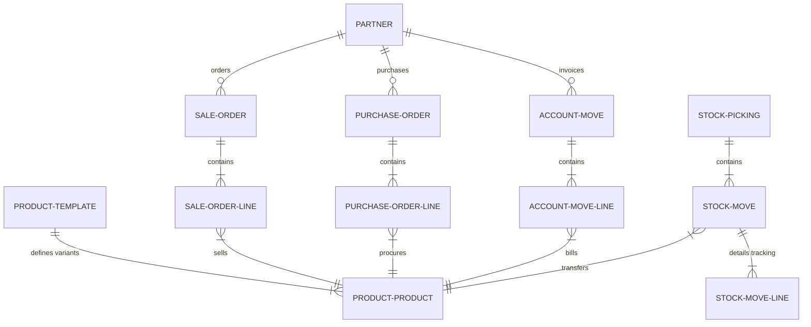

# System Data Model

This document specifies the primary relationships and schema patterns connecting the core entities in the Odoo ecosystem.

## Core Entity Relationships

The following entity-relationship diagram shows how the master data and transactional documents align across functional boundaries:

## Shared Conceptual Entities

### 1. Contacts and Partners (`res.partner`)
- Stores all actors: Customers, Vendors, Subcontractors, Employees, and Address locations.
- **Hierarchical Address Pattern**: Uses `parent_id` to establish parent-child hierarchies representing companies and their individual employee contacts or delivery addresses.
- **Type Enums (`type`)**: `contact` (standard employee), `invoice` (billing address), `delivery` (shipping address), `other` (general address).

### 2. Product Architecture (`product.template` and `product.product`)
- **Product Template (`product.template`)**: Represents the general product definition, storing properties shared by all variants (name, list price, cost, product type, category, and tax rules).
- **Product Product (`product.product`)**: Represents a specific variant of the template (e.g. Size: Large, Color: Blue). Uses delegation inheritance (`_inherits`) to map fields back to the template.
- **Product Types (`detailed_type`)**:
  - `consu` (Consumable): Products that are stocked but not tracked financially or quantity-wise in the inventory ledger.
  - `product` (Storable Product): Quantities and values are tracked in real-time. Operations trigger inventory moves and accounting valuations.
  - `service`: Non-physical items; does not trigger inventory moves.

### 3. Units of Measure (`uom.uom`)
- Holds units of measurement (e.g. Units, Liters, Kilograms, Hours).
- **UoM Category (`uom.category`)**: Groups units that can be converted between each other (e.g., Weight category contains Grams, Kilograms, and Tons).
- **Conversion Math**: Each UoM has a `factor` relative to the category reference unit, permitting automated volume and weight translations during sales, purchases, and shipments.
