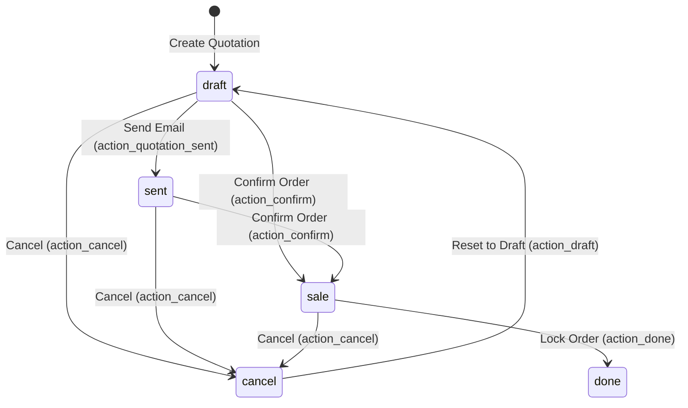
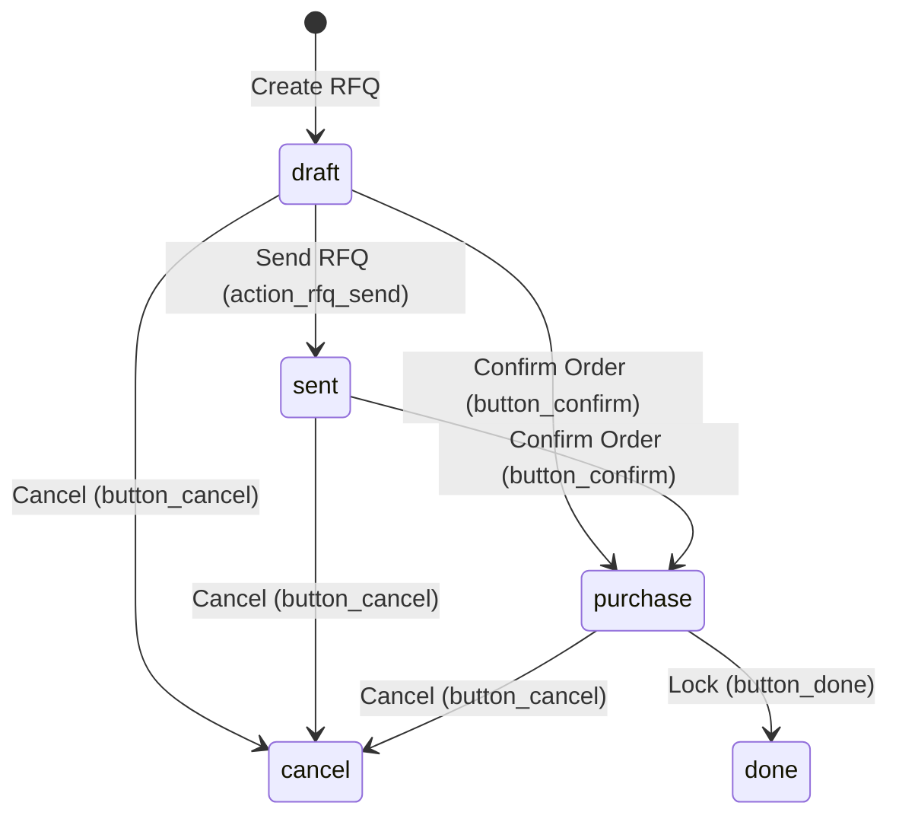
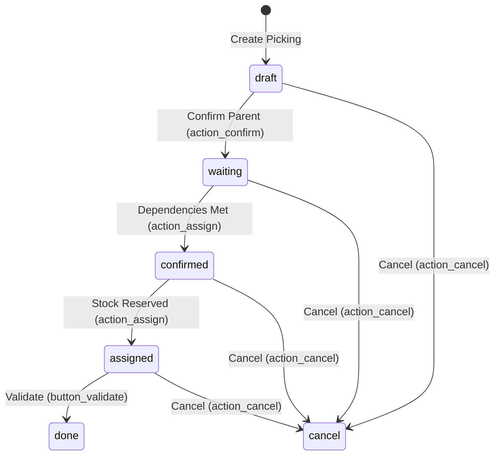
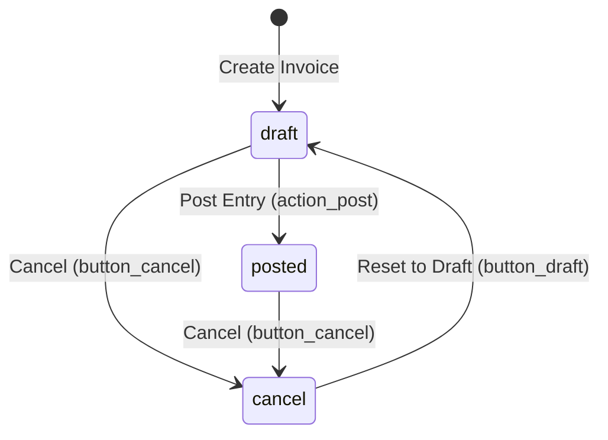

# Core Workflows and State Machines

This document outlines the Finite State Machine (FSM) lifecycles governing Odoo's primary transactional entities.

## 1. Sales Order Lifecycle (`sale.order`)

The Sales Order manages the customer purchase intent from initial pricing quote to final execution.

### State Definitions
- **Quotation (`draft`)**: Initial state of document. Editable by author.
- **Quotation Sent (`sent`)**: Sent to customer via email or portal. Price terms locked in standard configurations.
- **Sales Order (`sale`)**: Confirmed order. Triggers downstream inventory allocations and invoicing prompts.
- **Locked (`done`)**: Read-only order state representing completed execution. No modifications permitted.
- **Cancelled (`cancel`)**: Document invalidated. Historical placeholder.

### Core Transitions & Side Effects
- **Confirm (`action_confirm`)**:
  - Preconditions: Order must have lines; prices must be valid.
  - Side Effects:
    - Generates a **Stock Picking** (Delivery Order) if products are storable (`detailed_type = 'product'`).
    - Reserves stock quantity if available in source locations.
    - Registers sales team analytics data.

---

## 2. Purchase Order Lifecycle (`purchase.order`)

The Purchase Order governs vendor acquisitions.

### State Definitions
- **RFQ (`draft`)**: Request for Quotation template.
- **RFQ Sent (`sent`)**: Dispatched to vendor.
- **Purchase Order (`purchase`)**: Binding order confirmed. Triggers incoming shipment.
- **Locked (`done`)**: Finalized order history.

---

## 3. Stock Picking Lifecycle (`stock.picking`)

Manages physical warehouse items moving inside, outside, or between locations.

### State Definitions
- **Draft (`draft`)**: Under preparation, not yet confirmed.
- **Waiting Another Operation (`waiting`)**: Delayed due to preceding stock operations (e.g., waiting for manufacturing to complete).
- **Waiting (`confirmed`)**: Confirmed but quantities are not yet available in the source location.
- **Ready (`assigned`)**: Items are physically located and reserved. Ready for pick, pack, and shipment.
- **Done (`done`)**: Shipment validated, quantities removed from source location and transferred to destination location.
- **Cancelled (`cancel`)**: Movement aborted.

---

## 4. Account Move/Invoice Lifecycle (`account.move`)

Governs invoices (customer-facing) and vendor bills (supplier-facing).

### State Definitions
- **Draft (`draft`)**: Open for modification. No accounting ledger postings have occurred.
- **Posted (`posted`)**: Entry validated and active. Lock-in triggers:
  - Generates a permanent sequential number (Invoice Number).
  - Creates debits and credits in the corresponding journal ledger.
- **Cancelled (`cancel`)**: Voided document.
