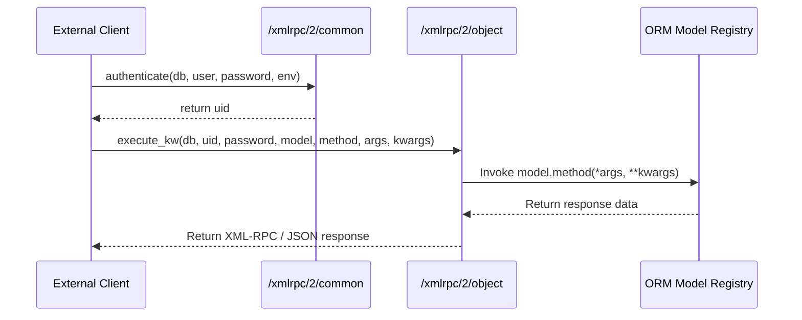

# API and Integration Model

This document specifies the communication interfaces, remote execution protocols, and session authentication mechanisms supported by Odoo 19.0.

## 1. Remote Procedure Call (RPC) Interfaces
Odoo exposes its entire ORM model registry to external integrations through two equivalent protocols: **XML-RPC** and **JSON-RPC**. Any method on any model class that does not start with an underscore (`_`) can be invoked remotely by authorized clients.



### Endpoints
- **Common Channel (`/xmlrpc/2/common`)**: Used for public/metadata queries and user authentication.
- **Object Channel (`/xmlrpc/2/object`)**: Used to query, create, write, delete, or invoke custom workflows on business objects via the `execute_kw` method.

### The `execute_kw` Signature
All external data operations are routed through `execute_kw`, which accepts:
1. `db`: The target database name.
2. `uid`: The authenticated user ID (integer).
3. `password`: The user password or personal API key.
4. `model`: The Odoo model name (e.g. `sale.order`).
5. `method`: The Python method name to execute (e.g., `search_read`, `create`, `write`, `action_confirm`).
6. `args`: Positional arguments passed to the method.
7. `kwargs`: Keyword arguments containing processing modifiers (such as domains, fields lists, offsets, limits, and contexts).

---

## 2. Standard Web Controllers
For standard HTTP traffic (web frontends, portal endpoints, and custom REST integrations), Odoo uses Werkzeug-based routing.

### Web Controller Routing Rules
- Controllers inherit from `odoo.http.Controller`.
- Routes are defined via `@http.route()` decorator:
  ```python
  class SalePortal(http.Controller):
      @http.route('/my/orders/<int:order_id>', type='http', auth='user', website=True)
      def portal_order_page(self, order_id, **kw):
          order = request.env['sale.order'].browse(order_id)
          return request.render('sale.portal_order_page_template', {'order': order})
  ```
- **Type (`type`)**:
  - `http`: Returns standard HTML responses, redirects, or files.
  - `json`: Returns JSON-RPC 2.0 payloads, automatically handling content-type negotiation and serialization.
- **Authentication (`auth`)**:
  - `none`: Session-free routes (used for system status probes).
  - `public`: Accessible by anyone; uses a generic guest/anonymous user session.
  - `user`: Enforces authorization check. If unauthenticated, redirects to login page.
