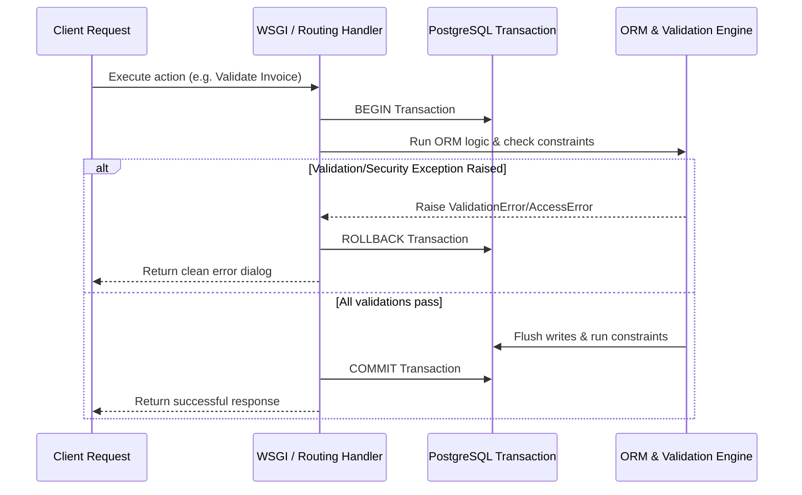

# Error, Exception and Validation Model

This document specifies the error taxonomy, transactional boundaries, validation rules, and rollback behaviors in Odoo 19.0.

## 1. Exception Taxonomy (`odoo.exceptions`)

Odoo defines a standardized taxonomy of exceptions to handle operational errors, security violations, and data anomalies:

| Exception Class | Purpose | User Presentation |
| :--- | :--- | :--- |
| **`UserError`** | Raised when a business workflow precondition is violated (e.g., attempting to validate a delivery order with no quantities set, or confirming a quotation without lines). | Renders as a warning dialog box with a user-friendly message. |
| **`ValidationError`** | Raised when python-level constraints (`@api.constrains`) fail (e.g., duplicate invoice reference, negative pricing). | Renders as a warning dialog detailing the validation rule that was violated. |
| **`AccessError`** | Raised when a user attempts to read, write, create, or delete a record for which they lack ACL or Record Rule permissions. | Renders as an "Access Denied" message explaining which security group or rule was triggered. |
| **`MissingError`** | Raised when the system tries to retrieve or perform operations on a record ID that has been deleted or does not exist. | Renders as a warning indicating the record no longer exists. |
| **`AccessDenied`** | Raised during login/authentication failures (wrong passwords, expired passkeys). | Renders as a standard "Wrong login/password" message. |

---

## 2. Transactional Boundaries and Rollback Behavior

All ORM actions triggered by user requests (JSON-RPC, HTTP, or cron triggers) are wrapped in atomic database transactions:

### Rollback Guarantees
- **Atomic Operations**: If any exception (such as `ValidationError` or `AccessError`) is raised at any point during a request lifecycle, the server intercepts the exception and issues a database `ROLLBACK` command.
- **Data Integrity**: This rollback ensures that no partial or inconsistent data is written. If a Sales Order confirmation fails due to an inventory valuation constraint, the Sales Order transitions back to its original state, and any partial delivery orders or journal moves generated during the transaction are completely expunged.
- **Concurrency Locking**: Odoo uses PostgreSQL **`SELECT FOR UPDATE`** locking (via `self.write()`, `self.unlink()`, or explicit call `self.flush_recordset()`) to prevent concurrent writes on the same record, raising serializability errors if two operations conflict.
