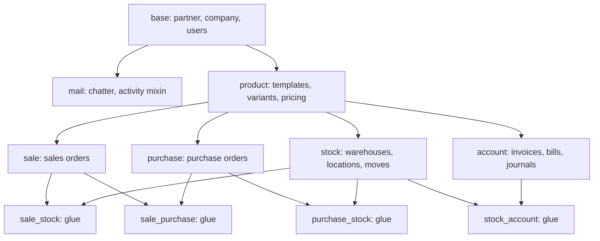

# Cross-Module Dependencies

This document provides a structural dependency analysis of Odoo's primary modules and details the "glue" modules that link them.

## Module Dependency Graph
Odoo uses a strict topological dependency order. Lower-level foundational modules have no knowledge of downstream modules, while higher-level modules inherit and extend lower-level objects.

## Critical Foundational Hubs

### 1. The `base` Module
- **Centrality**: Absolute core.
- **Key Concepts Exposed**: `res.partner` (contacts), `res.users` (accounts), `res.company` (tenant isolation), `res.currency` (accounting currency), `ir.model` (meta-model definition).
- **Downstream Impact**: Every other Odoo module depends on `base`.

### 2. The `mail` Module
- **Centrality**: High. Adds collaborative capabilities (Chatter) to business objects.
- **Key Concepts Exposed**: `mail.thread` (message storage and subscriber routing), `mail.activity.mixin` (task checklist scheduling), `mail.followers` (user subscriptions to document changes).
- **Downstream Impact**: CRM, Sales, Purchases, Inventory, and Projects inherit from `mail.thread` and `mail.activity.mixin` to provide the bottom chatter log.

---

## Glue Modules (Cross-Functional Integrations)

Odoo avoids bloating core modules by placing cross-functional behaviors in specialized "glue" modules:

### 1. `sale_stock` (Sales ↔ Inventory)
- **Role**: Triggers shipments upon sales order confirmations.
- **Key Operations**:
  - Automatically creates a `stock.picking` (Delivery Order) when a `sale.order` is confirmed.
  - Links sales order lines to stock moves, allowing the sales representative to view delivery status (e.g. draft, reserved, shipped, returned) directly on the sales order.

### 2. `purchase_stock` (Purchase ↔ Inventory)
- **Role**: Links acquisitions to incoming shipments.
- **Key Operations**:
  - Generates a `stock.picking` (Incoming Receipt) when a `purchase.order` is confirmed.
  - Updates the "Received Quantity" on the Purchase Order lines as items are validated in the warehouse.

### 3. `stock_account` (Inventory ↔ Accounting)
- **Role**: Performs real-time automated inventory financial valuations.
- **Key Operations**:
  - When inventory valuation is set to "Automated", validating a stock shipment/receipt triggers this module to generate a double-entry journal move (`account.move`) in the ledger, debiting/crediting stock valuation and cost-of-goods-sold (COGS) accounts.
