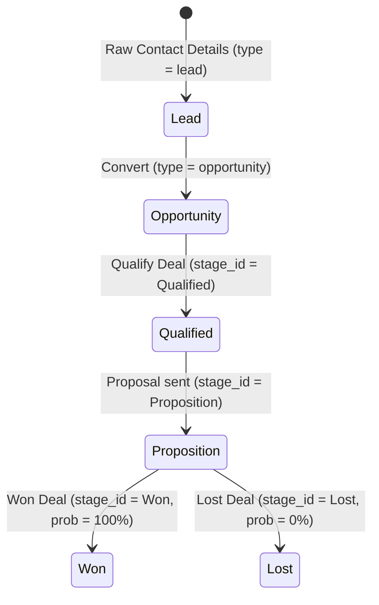

# Workflow: Lead-to-Opportunity

This document describes the prospective client funnel progression in Odoo CRM.

## Workflow Sequence

## Step-by-Step Requirements

### 1. Inbound Ingestion
- **Trigger**: Customer contact form submit or email ingestion.
- **Side Effect**: Creates a `crm.lead` record with `type = 'lead'` in `New` stage.

### 2. Opportunity Conversion
- **Actor**: Sales Representative.
- **Workflow**: Click "Convert to Opportunity".
- **Operation**: Updates `type` to `opportunity`. Checks if the partner already exists or creates a new customer partner (`res.partner`).

### 3. Pipeline Movement
- **Actor**: Sales Representative.
- **Operation**: Updates `stage_id` (Kanban drag-and-drop).
- **Side Effects**: Sets default probability for the stage. If stage is `Won`, sets `probability = 100`. If `Lost`, opens dialog to select `lost_reason_id` and sets `probability = 0`.
