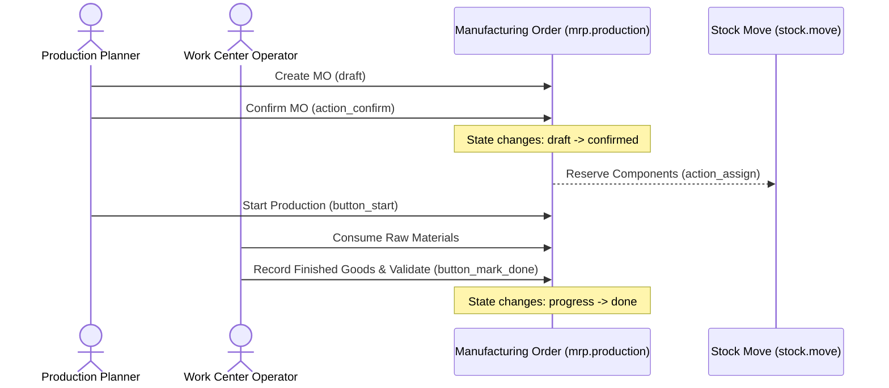

# Workflow: Manufacturing Flow

This document describes the material transformation process in Odoo MRP.

## Workflow Sequence

## Step-by-Step Requirements

### 1. Creation & Confirmation
- **Trigger**: Reordering rule triggers or user creates manual MO.
- **Workflow**:
  - Confirms the MO (`action_confirm()`).
  - Generates component reservation moves (`stock.move`) from inventory.

### 2. Component Availability Check
- **Workflow**: The scheduler runs `action_assign()` on component moves. If items are in stock, they are reserved for the MO. If not, the MO state remains `confirmed` (waiting for materials).

### 3. Execution & Close
- **Workflow**:
  - The planner starts production (`button_start()`).
  - Workers execute steps at work centers.
  - Upon completion, clicking "Mark as Done" consumes components, creates finished product stock moves, updates valuation, and closes the MO (`done` state).
