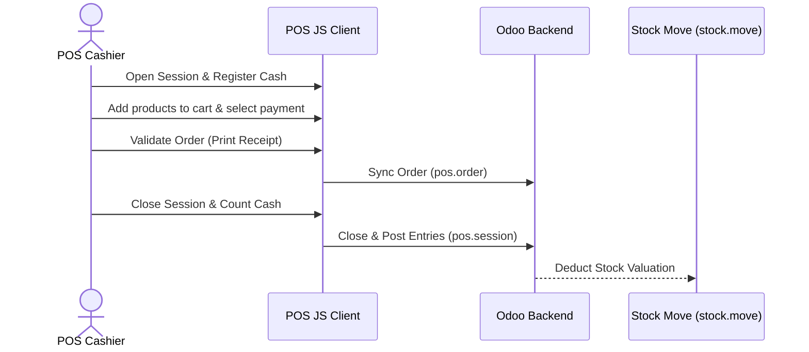

# Workflow: POS Checkout & Session Closure

This document describes the retail checkout transaction flow and POS session lifecycle.

## Workflow Sequence

## Step-by-Step Requirements

### 1. Opening Session
- **Workflow**: Cashier opens session (`pos.session`) and records starting cash.

### 2. Transaction Registration
- **Workflow**:
  - Cashier scans items, applies customer discounts, and selects payment methods (Cash/Bank).
  - Validation writes transaction records to local indexdb and pushes to backend via JSON-RPC.

### 3. Session Closure
- **Workflow**: At shift end, cashier counts drawer cash, submits closing values.
- **Backend Postings**: The server validates the session, creates journal entries for sales, payments, cash differences, and issues inventory deductions for storable products sold.
