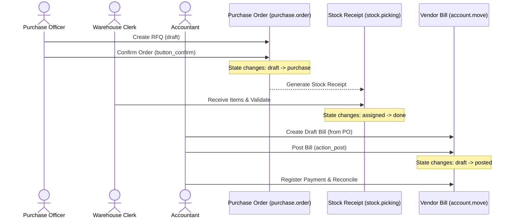

# Workflow: Procure-to-Pay

This document describes the end-to-end purchasing, warehouse receipts, and vendor billing workflow in Odoo.

## Workflow Sequence

## Step-by-Step Functional Requirements

### 1. Request for Quotation (RFQ)
- **Actor**: Purchase Officer.
- **Preconditions**: Vendor (`res.partner`) and Products (`product.product`) must be configured.
- **Workflow**:
  - Instantiate a new `purchase.order` in the `draft` (RFQ) state.
  - Choose vendor, currency, and line items. Costs are resolved based on supplier info records (`product.supplierinfo`).

### 2. Purchase Order Confirmation
- **Actor**: Purchase Officer.
- **Trigger**: Click `Confirm Order` in UI or execute `button_confirm()` via RPC.
- **Side Effects**:
  - Transitions state from `draft` / `sent` → `purchase`.
  - Automatically generates an incoming `stock.picking` (Stock Receipt) for storable products.

### 3. Goods Receipt
- **Actor**: Warehouse Clerk.
- **Workflow**:
  - Locates the pending incoming receipt (`stock.picking`) in `ready` (`assigned`) state.
  - Matches the physical items received, adjusts quantities if different from ordered, and clicks `Validate` (`button_validate()`).
- **Side Effects**:
  - Increments storable quantities in the warehouse location.
  - Updates the `qty_received` fields on the originating Purchase Order lines.

### 4. Billing & 3-Way Matching
- **Actor**: Accountant.
- **Trigger**: Click `Create Bill` on the Purchase Order.
- **Functional Check (3-Way Match)**:
  - The system compares the **Ordered Quantity** (Purchase Order), the **Received Quantity** (Stock Receipt), and the **Billed Quantity** (Vendor Bill).
  - If the billed quantity on the draft invoice exceeds the received quantity, the system marks the bill with a mismatch warning for accountant resolution.
- **Side Effects**:
  - Creates a draft `account.move` (`move_type = 'in_invoice'`).

### 5. Posting & Payment
- **Actor**: Accountant.
- **Workflow**:
  - Validates the draft vendor bill and clicks `Post` (`action_post()`).
  - Processes vendor payment and reconciles the bank ledger with the Accounts Payable account.
- **Side Effects**:
  - Transitions bill state from `draft` → `posted`.
  - Creates ledger entries: Debits Inventory Received, Credits Accounts Payable.
