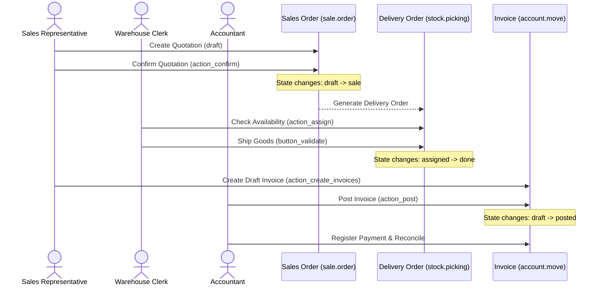

# Workflow: Quote-to-Cash

This document describes the end-to-end Sales, Inventory, and Invoicing workflow in Odoo.

## Workflow Sequence

## Step-by-Step Functional Requirements

### 1. Quotation Creation
- **Actor**: Sales Representative.
- **Preconditions**: Customer (`res.partner`) and Products (`product.product`) must be registered in the catalog.
- **Workflow**:
  - Instantiate a new `sale.order` in the `draft` state.
  - Specify customer and select items. Tax rules and default prices are resolved automatically based on the partner's fiscal position and active pricelist.

### 2. Confirmation (Order Lock-In)
- **Actor**: Sales Representative or Customer (via Portal signing).
- **Trigger**: Click `Confirm` button in UI or execute `action_confirm()` via RPC.
- **Validations**:
  - Verifies lines are present.
  - Verifies customer credit.
- **Side Effects**:
  - Transitions order state from `draft` / `sent` → `sale`.
  - Creates a `stock.picking` delivery document for storable products.

### 3. Inventory Dispatch
- **Actor**: Warehouse Clerk.
- **Workflow**:
  - Locates the pending delivery order (`stock.picking`) in `ready` (`assigned`) state.
  - Picks, packs, and validates the shipment (`button_validate()`).
- **Side Effects**:
  - Inventory quantities are decremented from the source bin.
  - The sales order's `qty_delivered` fields are synchronized with the delivered picking quantities.

### 4. Billing (Invoice Initiation)
- **Actor**: Sales Representative / Billing Specialist.
- **Trigger**: Click `Create Invoice` on the Sales Order.
- **Invoicing Rules (Context-Dependent)**:
  - **Invoice on Ordered Quantities**: Draft invoice is generated immediately after order confirmation, regardless of shipment status.
  - **Invoice on Delivered Quantities**: Invoice creation is blocked until the delivery order is validated (`qty_delivered > 0`).
- **Side Effects**:
  - Creates a draft `account.move` (`move_type = 'out_invoice'`).

### 5. Posting & Ledger Entry
- **Actor**: Accountant.
- **Workflow**:
  - Validates the draft invoice and clicks `Post` (`action_post()`).
- **Side Effects**:
  - Transitions invoice state from `draft` → `posted`.
  - Generates permanent invoice sequence numbers.
  - Creates active debit/credit postings in the financial ledgers.
