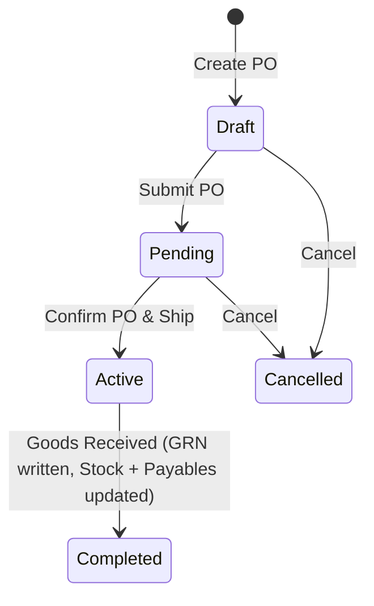
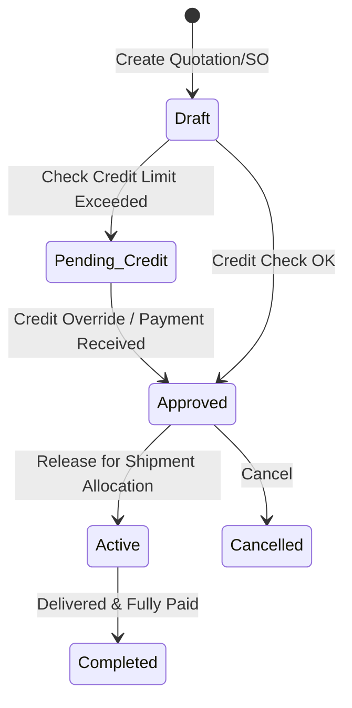
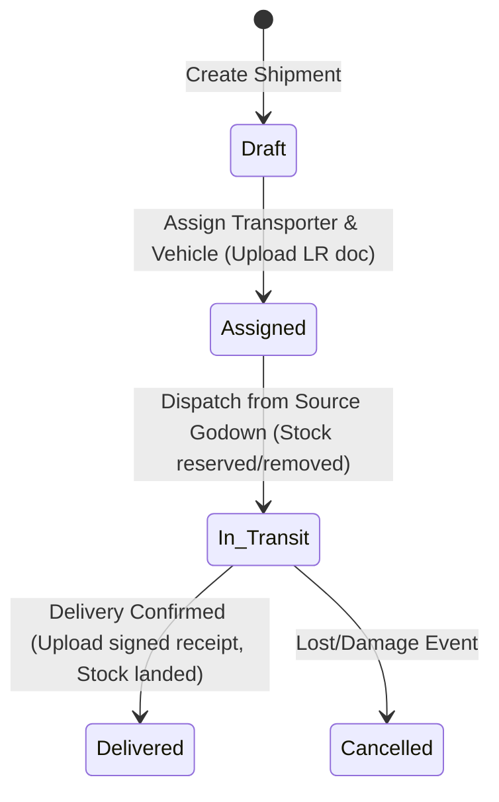

# Plywood Trading Business — Verity Capability Design

| | |
|---|---|
| **Client profile** | Plywood, laminate, MDF, and board trading business with multiple godowns, transport tracking, sales & purchases, ledger accounts, and GST invoicing. |
| **Document status** | **PARTIALLY BUILT / ACTIVE CLIENT CAPABILITY** — the plywood capability now exists in `src/server/capabilities/plywood/`, is registered from `src/server/capabilities/registry.ts`, and has additive Prisma tables/migrations. This document remains the design authority for target behaviour; each section below distinguishes built behaviour from remaining target/planned behaviour. |
| **Proposed capability id** | `verity.capability.plywood` |
| **Proposed pack framing** | None. One purpose-built reusable capability, not an industry pack. |
| **Platform state at 2026-09-01 update** | Foundation frozen at 2026-08-24 milestone (`implementation/PLATFORM-FREEZE.md`). Shipped capabilities now include Location, Asset, Evidence, Scheduling, Approval, Dine-in, and Plywood. Runtime storage binding is installed through the registry bootstrap. |

### 0.1 Architecture update from the last 3-4 days of commits

This document was originally written before the plywood build-out. The current implementation has moved beyond a paper model:

- **Current / built:** `verity.capability.plywood` is a shipped capability with catalog, party, godown/rack, purchase, sales, stock, invoice, payment, ledger, GST/tax, price-sheet, people, and workspace surfaces.
- **Current / built:** suppliers are always linked to a customer-side record; an explicit "also a customer" choice is gone. The link uses GSTIN matching when available and otherwise creates the paired customer record.
- **Current / built:** the sales desk now uses the business terms **Paid now** and **Owed** instead of a generic credit-approval framing. Orders can create a receivable immediately, and payments can settle invoice balances or sit as customer/supplier balance for later allocation.
- **Current / built:** sales and purchase orders can be edited while still legally mutable, and customers, suppliers, godowns, racks, and orders can be retired/removed through commands instead of direct deletion.
- **Current / built:** order lines snapshot product specifications, agreed prices, discounts up to 100%, GST exemption, tax-inclusive totals, and generated invoice/tax lines in plain business language.
- **Current / built:** stock operations have one **Update stock** control with six operational tabs behind it, while rack withdrawal is now supported from godowns without erasing stock history.
- **Current / built:** the shell and operational surfaces use the current accent-driven glass material system and semantic dark-mode tokens; recent UI work corrected table clipping, dropdown layering, mobile reach, and balance wording.
- **Still planned / target:** transporter handoffs, LR evidence, e-way bill automation, rental-contract ledgers, and deeper logistics tracking remain target behaviours unless a matching implementation is added under the plywood capability.

---

## 1. Client requirements (as received)

A plywood, laminate, MDF, and board trading management system covering:

1. **Inventory Management (Core)**
   - Plywood/laminate/MDF/board product master (Brand, Thickness, Size/dimensions, Grade, Sheet/unit count).
   - **Raw Timber & Sawn Wood**: Sized planks, structural timber (Teak, Marandi, Sal, Kapoor, Rosewood) priced and tracked by Volume (CFT - Cubic Feet) or Length (RFT - Running Feet).
   - **Engineered Wood & Boards**: Commercial Plywood (MR), Marine Plywood (BWR/BWP), Core Boards (HDHMR, Boilo, MDF, Particle boards), Blockboards, and Flush doors.
   - **Decorative Surfacing**: Laminates/Sunmica, Acrylic sheets, Natural veneers, Wall Louvers, and Charcoal fluted panels.
   - **Interior Hardware & Fittings**: Modular kitchen hardware (drawer slides, hinges, baskets), door handles, locks, and hinges.
   - Stock by warehouse/godown.
   - Stock inward/outward and stock transfers.
   - Damaged/returned stock and physical stock adjustment.
   - Low-stock alerts and stock valuation.
2. **Purchase & Supplier Management**
   - Supplier master and supplier-wise pricing.
   - Purchase orders, purchase invoices, and goods received.
   - Pending purchases, supplier outstanding, and supplier ledger / purchase history.
3. **Sales & Customer Management**
   - Customer/dealer/contractor master (Serving retail consumers, decorators, and commercial contractors).
   - Quotations and sales orders.
   - Price lists, customer-specific pricing, and credit limits.
   - Outstanding payments, sales history, and returns.
4. **Finance / Accounts (Core Care Area)**
   - Sales invoices, purchase invoices, receivables, and payables.
   - Customer ledger and supplier ledger.
   - Payment collection and payment entries.
   - Credit/debit notes and GST-ready invoice data.
   - Profit/margin tracking and daily/monthly financial reports.
5. **Invoice Generation**
   - Professional GST invoices and delivery challans.
   - E-invoice/e-way bill integration later if required (out of scope for v1 / manual placeholders).
   - PDF/print/share, invoice numbering, payment status, and outstanding against invoice.
6. **Logistics (Major Requirement)**
   - Track flow: Purchase → Supplier → Transport → Godown → Customer.
   - Transporter master, vehicle details, and LR/transport documents.
   - Incoming shipment, outgoing shipment, dispatch, delivery status, and delivery confirmation.
   - Freight charges, who is paying freight, and material currently in transit.
   - Primary owner questions answered:
     - *"Mera maal abhi kahan hai?"* (Where is my material right now?)
     - *"Kis customer ko kya bheja hai aur deliver hua ya nahi?"* (What has been sent to which customer, and is it delivered or not?)
7. **Warehouse / Godown (First-Class Module)**
   - Multiple godowns with rack/location tracking.
   - Stock by godown and inter-godown transfer.
   - Receiving, dispatch, stock count, damaged stock, and reserved stock.
8. **Dashboard & Services**
   - Owner dashboard: Today's Sales | Today's Purchases | Stock Value | Receivables | Payables | Pending Deliveries | In-Transit Material | Low Stock.
   - **Commercial Sawmill & Construction Services**: 
     - *Custom Sized Wood Saws*: Precision cutting timber logs into custom sections based on blueprints.
     - *Door Frame Customisation*: Manufacturing wholesale chaukhats to architectural dimensions.
     - *Shuttering Timber Rentals*: Leased commercial plywood and logs (ballies) for temporary concrete slabs.
     - *Material Estimations*: On-site calculations for required timber volumes.

### Derived operational requirements (made explicit so scope is testable)
- **Paise-granular arithmetic**: All pricing, invoice totals, payments, and ledger balances are stored in integer minor units (paise) to prevent float representation drift.
- **Append-only Ledgers**: Stock ledger movements and financial ledger entries are append-only. Once
  written, they are never edited or deleted; adjustments are recorded as new transaction lines with
  mandatory reason references. **This is enforced by a database trigger that rejects UPDATE and
  DELETE**, following the pattern `activity`, `security_audit_event` and `domain_event` already use.
  A ledger that is append-only only because no code writes an UPDATE stays append-only exactly until
  someone writes one.
- **Transporter Handoffs & LR (Lorries Receipt)**: Transit transitions require a document reference (LR No.) and a state machine to satisfy tracking queries.
- **Tax Breakdown Preservation**: Invoices snapshot CGST, SGST, IGST rates and values at execution. Catalogue edits never retrospectively alter tax or price totals on completed bills.

### Required Verity Platform & Schema Upgrades
To fully support Shri Ganesh Timber's expanded catalog, the following architectural upgrades are required in Verity's backend:
1.  **Product UOM (Unit of Measure) Extension**: Add a `uom` (Unit of Measure) enum/string field to the product catalog model to handle `CFT` (Cubic Feet) and `RFT` (Running Feet) volume-based pricing and stock calculations, alongside the default `sheets` or `pcs` units.
2.  **Optional Dimensions for Non-Sheet Items**: Currently, the Postgres schema enforces `thicknessTenthMm`, `widthMm`, and `heightMm` as strictly positive non-null integers (`plywood_product_dimensions_positive`). This must be relaxed to allow nullable dimensions for hardware items and services.
3.  **Product Type Distinction (`PHYSICAL` vs `SERVICE`)**: Introduce a `type` field on products. Services (like sawing and estimating) must bypass stock balance lookups (`stock_balance` records) and movement ledgers.
4.  **Rental Contract Ledger**: To support shuttering plywood and log leasing services, a rental contract entity must be added to track items in possession of contractors and handle rental deposit/return balances.

### Explicitly not requested and therefore out of scope for v1
- Live GPS telemetry / maps (location tracking is manual status update by logistics coordinators).
- Automatic API integration with government E-invoice / E-way bill portals (system records e-way bill number and uploads PDFs as Evidence).
- Multi-currency support (exclusively local INR).
- Multi-tenant shared stock (tenancy boundary remains absolute under INV-001).
- Automated barcode scanner hardware integrations (manual search and select is standard).

---

## 2. Authority position

### 2.1 The decision path this document follows
`implementation/PLATFORM-FREEZE.md`: *can existing Verity primitives support it? If yes, build the capability; if no, smallest additive extension justified in writing.*
- **Godowns** map to the platform's `Location` primitive.
- **Delivery vehicles** map to the platform's `Asset` primitive.
- **Transport documents, LR scans, and invoice PDFs** map to the platform's `Evidence` primitive (stored checksum-frozen files).
- **Sales Orders, Purchase Orders, and Shipments** are **capability-owned entities with their own
  state machines**, declared through the platform's `StateDefinition` / `TransitionDefinition`
  registries and driven by the command runtime. They do **not** map to a `Work` primitive: no `Work`
  capability exists, and describing them that way would send a reader looking for a reuse that is not
  there. This is the same shape as Kent's `DiningOrder`, and it is the correct one.
- **B2B Partners (Customers, Suppliers, Transporters)** map to capability-owned entities that link to `Party` records when logins are required (e.g. for transporter tracking).
- No core platform changes are proposed; all models are capability-private database extensions.

### 2.2 Scope boundaries
- **GOV-SCO-006** (consumer retail storefronts and POS hardware out of scope): The billing flow is **record-and-print**. No cash drawer hooks, physical card terminals, or payment gateway APIs.
- **PLATFORM-FREEZE**: No generic financial ledger framework or double-entry engine is added to platform core. All ledger mappings are capability-private, simple tables.

### 2.3 Canonical terminology compliance
All names respect GOV-TER-001..017.
- **`Location`** is used for Warehouses and Godowns.
- **`Asset`** is used for Vehicles.
- **`SalesOrder`**, **`PurchaseOrder`** and **`Shipment`** are capability-owned entities. `Work` is
  the canonical term for a Work Order (GOV-TER-004) and is deliberately **not** claimed here.
- **`Customer`**, **`Supplier`**, and **`Transporter`** are capability-owned entities.
- **`Evidence`** is used for LR documents and signed delivery receipts.

---

## 3. Platform fit — requirement → primitive map

| Plywood requirement | Existing primitive that carries it | Status of primitive |
|---|---|---|
| Tenant isolation | Tenant + RLS via `withTenant()`; fail-closed GUC | BUILT / PROVEN |
| Staff and Partner logins | Supabase Auth + Party/User/TenantMembership | BUILT / PROVEN |
| Godowns / Warehouses | `Location` primitive (Place + Address) | BUILT / PROVEN |
| Delivery Vehicles | `Asset` primitive | BUILT / PROVEN |
| LR documents, confirmation signatures | `Evidence` (checksum-frozen `StoredFile` references) | BUILT / PROVEN |
| Sales Orders and Purchase Orders | Capability-owned entities; state machines via `StateDefinition` / `TransitionDefinition`; editable only before irreversible receipt/issue/invoice effects | BUILT |
| Shipments / transporter handoffs | Capability-owned target entities; LR/evidence linkage remains planned | DEMONSTRATED / PLANNED |
| Stock / Financial Ledgers | Capability-owned stock balances, stock ledger entries, invoice/payment allocation, and plywood ledger entries | BUILT |
| GST Invoice PDFs | `Evidence` / `StoredFile` two-phase contract | BUILT / PROVEN |
| Owner Alerts (Low Stock, Exceeded Credit) | Notification substrate (`notify()`, templates, suppressions) | BUILT |
| Dashboard KPI statistics | Server components + chart primitives (`Donut`, `BarStrip`), workspace contributions | BUILT |

---

## 4. Tenant & organization topology

```
Tenant: "National Plywood Distributors"   timeZone: Asia/Kolkata (configurable at provisioning)
└── Organization: "Central HQ & Office"   (HQ staff: Owner, Sales, Finance, Logistics)
    ├── Location: "Godown A - Okhla"      (Godown staff, Rack/location structure)
    └── Location: "Godown B - Noida"      (Godown staff, Rack/location structure)
```

---

## 5. Staff identity, roles & permissions

### 5.1 Roles
Closed set of roles for the plywood capability:
- `Owner`: Full management control over margins, stock adjustments, financial reports, ledger corrections, and configuration.
- `Warehouse Clerk`: Manages stock inward/outward, inter-godown transfers, dispatches, and physical stock counts.
- `Sales Representative`: Manages quotations, sales orders, price lists, customer profiles, and collections.
- `Purchase Representative`: Manages supplier profiles, purchase orders, purchase invoices, and GRN checks.
- `Logistics Coordinator`: Manages transporters, vehicle listings, shipping documents (LR), dispatches, transit updates, and delivery status updates.
- `Finance Accountant`: Manages customer/supplier outstanding ledgers, tax data, invoicing, and profit tracking.

### 5.2 Permission matrix
Verbs from the closed set (PLA-AUT-003); actions ride `ActionExecute`. All grants at Tenant level.

| Entity | Read | Create | Edit | Delete | ActionExecute |
|---|---|---|---|---|---|
| `verity.plywood.product` | All | Owner, Warehouse | Owner, Warehouse | — | — |
| `verity.plywood.stock_ledger` | All | (auto via movements) | — | — | adjust-stock (Owner) |
| `verity.plywood.sales_order` | Owner, Sales, Finance, Log | Sales | Sales (draft only) | — | approve-credit (Owner, Finance), ship (Logistics) |
| `verity.plywood.purchase_order`| Owner, Purchase, Warehouse | Purchase | Purchase (draft only)| — | receive-goods (Warehouse) |
| `verity.plywood.shipment` | All | Logistics, Purchase | Logistics | — | dispatch (Logistics), confirm-delivery (Logistics) |
| `verity.plywood.customer` | Owner, Sales, Finance | Sales | Sales | — | block-credit (Owner, Finance) |
| `verity.plywood.supplier` | Owner, Purchase, Finance | Purchase | Purchase | — | — |
| `verity.plywood.invoice` | Owner, Finance, Sales | Finance | — | — | print, record-payment (Finance, Sales) |
| `verity.plywood.finance_ledger` | Owner, Finance | (auto via actions) | — | — | correct-ledger (Owner) |

---

## 6. Domain model — modules and entities

Every model carries the base-entity shape (`id, tenantId, createdAt, updatedAt, version, customFields`) and is protected by the default RLS policy. Money is stored in paise (`pricePaise`).

### Module M1 — Product Catalog (`verity.plywood.product`, `verity.plywood.brand`)
- **Brand**: `name`, `active`.
- **Product**: `brandId FK`, `name`, `hsnCode String` (**required on a GST invoice by law** — CBIC
  notification 78/2020 sets the digit count by turnover; the field is stored as given and validated
  for length, not invented), `thicknessTenthMm Int` (tenths of a millimetre, e.g. 180 for 18.0 mm),
  `widthMm Int`, `heightMm Int`, `grade` (e.g. BWR, MR, Marine), `sheetWeightGrams Int?`,
  `reorderLevelUnits Int`, `unitLabel` (default "sheets").

  `thicknessMm` was named for "basis points/tenths" in an earlier draft, which conflated two
  different units. Basis points are a rate unit and belong to tax and discount rates; a physical
  thickness in tenths of a millimetre is not a rate. The field name now says which it is.

### Module M2 — Inventory & Godowns (`verity.plywood.stock_ledger`, `verity.plywood.godown_rack`)
- **GodownRack**: `locationId FK` (Location primitive), `rackLabel String`.
- **StockLedger**: `productId FK`, `locationId FK`, `rackId FK?`, `kind`
  (`purchase_inward | sales_outward | transfer_in | transfer_out | adjust_in | adjust_out |
  returned_stock`), `qtyUnits Int`, `unitCostPaise Int` (valuation source), `salesOrderId FK?`,
  `purchaseOrderId FK?`, `shipmentId FK?`, `reason String?`, `byUserId FK`.
  **Append-only, enforced by trigger.**

  The typed nullable references replace an earlier `refEntityKey` + `refEntityId` pair. A polymorphic
  pair carries no foreign key, so nothing stops a row pointing at an order that no longer exists.
  Typed columns give the same expressiveness with real referential integrity, and a check constraint
  enforces that at most one is set.

  Implementation update: current stock screens expose one **Update stock** control whose tabs cover the day-to-day stock actions. Godown racks can be withdrawn through the godown UI; withdrawal is a lifecycle/action result, not a history rewrite.

### Module M3 — Purchase & Supplier Management (`verity.plywood.supplier`, `verity.plywood.purchase_order`, `verity.plywood.supplier_pricing`)
- **Supplier**: `displayName`, `gstin String?`, `phone String?`, `email String?`, `linkedCustomerId FK`, `outstandingBalancePaise Int`.
  Every supplier now has a customer-side identity as well. The system links by GSTIN when that customer already exists; otherwise supplier creation creates the paired customer record automatically.
- **PurchaseOrder**: `supplierId FK`, `state` (`draft | pending | active | completed | cancelled`),
  `totalCostPaise Int`.
- **PurchaseOrderLine**: `purchaseOrderId FK`, `productId FK`, `productNameSnapshot String`,
  `hsnCodeSnapshot String`, `qtyOrdered Int`, `qtyReceived Int @default(0)`, `unitCostPaise Int`.
  A table, **not** a `Json` column: `qtyOrdered` versus `qtyReceived` per line is exactly what a
  partial receipt turns on, and "what is still owed on PO-4471" must be answerable without loading
  every purchase order. `Json` here would also fail the over-genericity conformance check, which
  permits it only at declared extension points.
- **SupplierPricing**: `supplierId FK`, `productId FK`, `negotiatedCostPaise Int`.

### Module M4 — Sales & Customer Management (`verity.plywood.customer`, `verity.plywood.sales_order`, `verity.plywood.customer_pricing`)
- **Customer**: `displayName`, `gstin String?`, `phone String?`, `creditLimitPaise Int`, `outstandingBalancePaise Int`.
- **SalesOrder**: `customerId FK`, `state`
  (`draft | pending_credit | approved | active | completed | cancelled`), `totalPricePaise Int`.
- **SalesOrderLine**: `salesOrderId FK`, `productId FK`, `productNameSnapshot String`,
  `hsnCodeSnapshot String`, `qtyOrdered Int`, `qtyShipped Int @default(0)`, `unitPricePaise Int`.
  A table for the same reasons as `PurchaseOrderLine`, and it snapshots name, HSN and price so a
  later catalogue edit never rewrites a completed order.
- **CustomerPricing**: `customerId FK`, `productId FK`, `customPricePaise Int`.

Implementation update: the current sales flow no longer presents the owner's decision as "credit approval" by default. It asks how much is **paid now** and how much is **owed**, then writes the correct receivable/payment/ledger effects. Credit-style holds still exist as control states, but the primary user language is cash-now versus balance-due.

### Module M5 — Logistics & Shipment Tracking (`verity.plywood.transporter`, `verity.plywood.shipment`)
Tracks: Supplier/Godown → Transport → Godown/Customer.
- **Transporter**: `name`, `phone String?`, `email String?`, `vehicleDetails String?`.
- **Shipment**: 
  - `transporterId FK?`,
  - `vehicleAssetId FK?` (Asset primitive reference),
  - `lrNumber String?` (Lorries Receipt / tracking reference),
  - `sourceLocationId FK` (Location primitive),
  - `destLocationId FK?` (inter-godown transfer location),
  - `destCustomerId FK?` (customer sales order location),
  - `salesOrderId FK?` / `purchaseOrderId FK?` — typed, with a check constraint that **exactly one**
    is set (a shipment always moves goods for one order or the other),
  - `freightChargePaise Int @default(0)`,
  - `freightPayer` (`tenant | customer | supplier`),
  - `lrEvidenceId FK?` (Evidence primitive link to scan),
  - `deliveryEvidenceId FK?` (Evidence primitive link to signed receipt),
  - `state` (`draft | assigned | in_transit | delivered | cancelled`),
  - `dispatchedAt DateTime?`,
  - `deliveredAt DateTime?`.

### Module M6 — Finance & Accounts (`verity.plywood.finance_ledger`, `verity.plywood.invoice`, `verity.plywood.payment_entry`)
- **Invoice**: `customerId FK?`, `supplierId FK?`, `salesOrderId FK?`, `purchaseOrderId FK?` (typed,
  check-constrained to exactly one), `invoiceNumber String`, `seriesKey String`,
  `financialYear String`, `placeOfSupplyStateCode String`, `cgstPaise Int`, `sgstPaise Int`,
  `igstPaise Int`, `taxablePaise Int`, `totalPaise Int`, `paymentStatus`
  (`unpaid | partial | paid`), `outstandingPaise Int`.
  Numbering, series and place of supply are listed here because **P2** and **P4** in
  `implementation/plywood-gap-analysis.md` decide their behaviour; the columns exist either way.
- **PaymentEntry**: `invoiceId FK`, `partyType` (`customer | supplier`), `partyId Uuid`, `method` (`bank | upi | cash`), `amountPaise Int`, `reference String?` (UTR/UPI TxId), `paymentDate DateTime`.
- **FinanceLedger**: `partyType` (`customer | supplier`), `partyId Uuid`, `entryType` (`debit | credit`), `amountPaise Int`, `invoiceId FK?`, `paymentEntryId FK?`, `runningBalancePaise Int`, `createdAt DateTime`. **Append-only.**

Implementation update: payments can settle generated invoices or remain on the party balance for later settlement. Ledger and party-list screens now say the balance direction in words instead of relying on a negative sign.

---

## 7. Operational flows & state transitions

### 7.1 Purchase flow


### 7.2 Sales & credit flow


### 7.3 Logistics & tracking flow
Answering: *"Mera maal abhi kahan hai?"* (Where is my material right now?)


---

## 8. UI/UX layout, pages & workspaces contribution

### 8.1 Workspaces
1. **Owner Console**
   - KPI Strip (Today's Sales, Purchases, Stock Value, Receivables, Payables, Pending Deliveries, In-Transit Material, Low Stock).
   - Margin and Profit Chart (based on Invoiced sales price vs average stock cost).
   - Audit trail and security log tabs.
2. **Inventory Manager Workspace**
   - Godown Selector grid (Stock distribution list by warehouse, rack level).
   - Inter-Godown Transfer card.
   - Low-Stock alerts column and physical adjustment forms.
3. **Sales & Customer Workspace**
   - Customer Master & Outstanding Ledger panel.
   - Sales Order booking card.
   - Outstanding payment follow-ups dashboard.
4. **Purchase & Supplier Workspace**
   - Supplier ledger and pricing card.
   - Purchase order generator.
   - Incoming delivery schedule calendar.
5. **Logistics Control Centre**
   - Live Dispatch queue.
   - Transporter registry and asset fleet allocation.
   - **Shipment Locator Input**: A prominent search field allowing the owner or logistics coordinator to input a Customer Name, Sales Order, or LR Number and immediately receive a status map (e.g. *Supplier → Transporter [Vehicle No, LR] → In-Transit [Since 2 days] → Destination Godown*).

---

## 9. Open gaps/decision points

### 9.1 Decisions that gate the build

`implementation/plywood-gap-analysis.md` §4 puts six decisions to the product owner. They are listed
here so this document is not read as though it settles them:

| | Decision | Gates |
|---|---|---|
| **P1** | Stock costing method — weighted average / FIFO / last cost | Stage 2 valuation, and every margin figure |
| **P2** | Invoice numbering — gapless counter row / sequence / number-at-settlement | Stage 6 |
| **P3** | Where a party's balance lives — derived from the ledger / running balance / cached on the party | Stage 6, and the duplicate `outstandingBalancePaise` fields in §6 M3 and M4 |
| **P4** | Place of supply — derive from state codes / ask / configure a default | Stage 6 tax |
| **P5** | Reserved stock — reservation table / pseudo-godown / none in v1 | Stage 2 |
| **P6** | Transporter access — records only / transporter portal | Stage 5, and an ADR if a portal |

Stage 1 (catalogue, brand, godown racks) is gated by none of them and is the only stage that may
begin before they are answered.

### 9.2 E-Way Bill & GST portal automation

> [!WARNING]
> **E-Way Bill & GST Portal Automation**
> Portal integration is deferred to manual file uploading in v1. Building automated government API gateways introduces substantial external dependencies and maintenance costs. The platform will instead record the Government reference ID and hold a PDF scan as `Evidence`.
