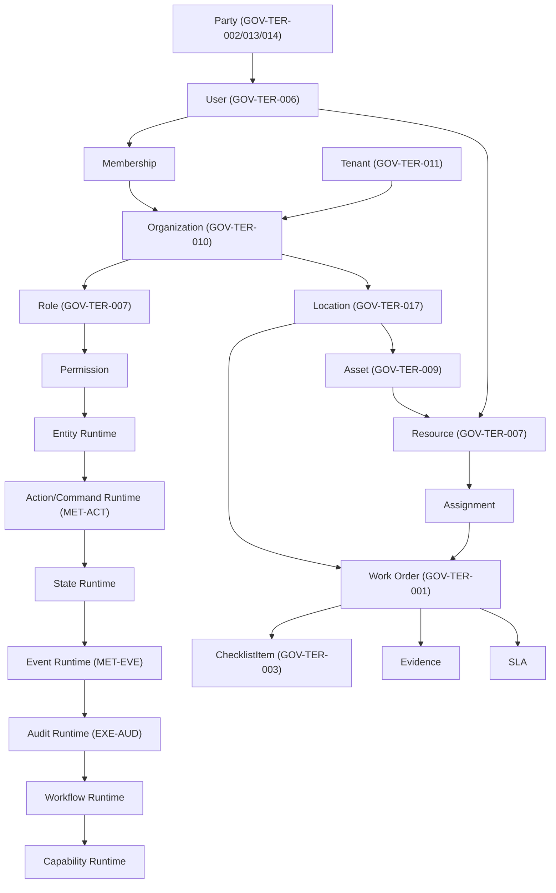

# Architecture Dependency Graph

## Purpose
Provides a machine-readable dependency graph for the platform, derived strictly from specification cross-references and glossary definitions.

## Scope
Covers foundational components and core capabilities.

## Authority
- **Spec GOV-TER-001→017**: Glossary dependencies.

## Prerequisites
- None.

## Specification Requirements
- Strict dependency adherence based on definitions.

## Approved Architecture
- Graph representation of architectural dependencies.

## Implementation Contract

### Foundation Dependency Graph

### Capability Dependency Matrix

| Capability | Depends On | Depended On By | Dependency Mechanism |
|-----------|-----------|----------------|---------------------|
| Party | (none — foundation) | User, CRM, Contract | Direct type import |
| User | Party | Role, Permission, all | 1:1 link |
| Role | (platform) | Permission, all | Platform service |
| Permission | Role | all capabilities | Authorization check |
| Organization | Tenant | Location, Resource, Work | Scoping |
| Location | Organization | Work, Asset, Resource | FK reference |
| Resource | User, Asset | Work, Scheduling | Assignment contract |
| Asset | Location | Resource, Maintenance | FK reference |
| Work | Resource, Location | Projects, Field-Service | Core operational |
| Contract | Party, Organization | Work, SLA, Finance | Terms/pricing |

### Build Order (Topologically Sorted)
1. **Tenant + Auth** (foundation, no domain dependencies, GOV-TER-011)
2. **Party** (no domain dependencies, INV-003)
3. **User** (depends on Party, GOV-TER-006)
4. **Role + Permission** (depends on User)
5. **Organization** (depends on Tenant, GOV-TER-010)
6. **Location** (depends on Organization, GOV-TER-017)
7. **Resource** (depends on User, Asset, GOV-TER-007)
8. **Asset** (depends on Location, GOV-TER-009)
9. **Work Order** (depends on Resource, Location, GOV-TER-001)

## Constraints & Invariants
- No undeclared direct dependency between capabilities.

## Dependencies
- Documented in matrix.

## Failure Modes
- Cyclic dependencies leading to compilation errors or design flaws.

## Testing Requirements
- Architecture linting to enforce dependency rules.

## Conformance Checks
- Build system verifies graph constraints during compilation.

## Traceability
- Traced to GOV-TER glossary specifications.

## Open Decisions
- None.
