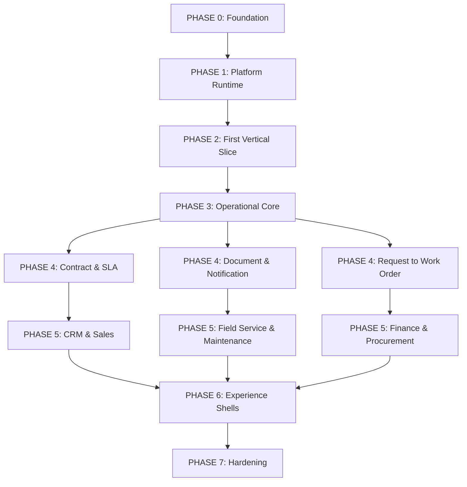

# Phase Dependencies

## Purpose
This document provides the Directed Acyclic Graph (DAG) of build phases for the Verity platform, showing dependency constraints based on specification requirements.

## Scope
Defines the dependency chains and parallelism opportunities across all build phases.

## Authority
- **Spec GOV-TER**: Glossary dependencies
- **Bible V1/V5**: Infrastructure dependencies

## Prerequisites
- Implementation Roadmap (Phase definitions)

## Specification Requirements
- Clear dependency mapping from capability requirements.

## Approved Architecture
- Layered dependency architecture. Capabilities cannot be built before their foundational entities (e.g., Work requires Resource and Location).

## Implementation Contract

### Dependency Graph

### Dependency Analysis

- **Phase 0 → Phase 1**: WHY: Platform runtime (Commands, Events) requires Tenant isolation and Auth context (PLA-TEN, INV-001).
- **Phase 1 → Phase 2**: WHY: First vertical slice (Party) requires domain runtime primitives and authorization engine (MET-ACT, EXE-AUD).
- **Phase 2 → Phase 3**: WHY: Operational core (Work Order) requires Location and Resource (User/Party) (GOV-TER-001, GOV-TER-006).
- **Phase 3 → Phase 4 (Parallel)**: WHY: Supporting capabilities depend on the operational core but are orthogonal to each other.
- **Phase 4 → Phase 5 (Parallel)**: WHY: Business capabilities depend on specific supporting elements (e.g., CRM depends on Contracts and Requests).

### Parallelism Opportunities
- After Phase 3, development can branch into parallel tracks (P4A, P4B, P4C).
- Phase 6 shells can be developed independently once Phase 5 endpoints are stable.

### Critical Path Analysis
- The longest chain is Phase 0 → Phase 1 → Phase 2 → Phase 3. This is purely sequential and forms the critical path.

### Failure Impact
- If Phase 0 or 1 fails, all downstream phases are blocked.
- If a Phase 4 sub-track fails, only dependent Phase 5 business capabilities are affected.

## Constraints & Invariants
- Dependencies must strictly follow the DAG. No circular dependencies.

## Dependencies
- Documented in the graph above.

## Failure Modes
- False assumptions about parallel tracks can cause integration issues.

## Testing Requirements
- Validate dependency graph against capability imports.

## Conformance Checks
- Ensure no capability imports from a downstream phase.

## Traceability
- GOV-TER-001 through 017 dependencies.

## Open Decisions
- IMPLEMENTATION DECISION REQUIRED: Granular sub-phase parallelism tracking mechanisms.
