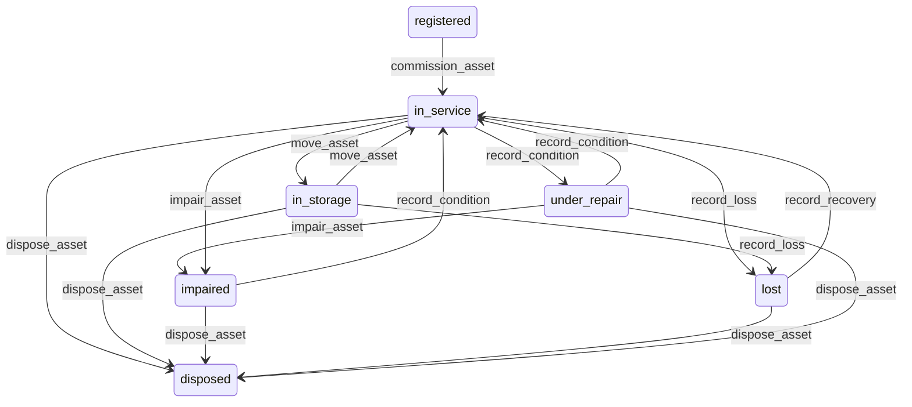

# State machine — Asset

*Generated. Edit `_model/capabilities/assets.yaml`, not this file.*

## Transition matrix

| From \\ To | `registered` | `in_service` | `in_storage` | `under_repair` | `impaired` | `lost` | `disposed` |
|---|---|---|---|---|---|---|---|
| **`registered`** | · | `commission_asset` | — | — | — | — | — |
| **`in_service`** | — | · | `move_asset` | `record_condition` | `impair_asset` | `record_loss` | `dispose_asset` |
| **`in_storage`** | — | `move_asset` | · | — | — | `record_loss` | `dispose_asset` |
| **`under_repair`** | — | `record_condition` | — | · | `impair_asset` | — | `dispose_asset` |
| **`impaired`** | — | `record_condition` | — | — | · | — | `dispose_asset` |
| **`lost`** | — | `record_recovery` | — | — | — | · | `dispose_asset` |
| **`disposed`** | — | — | — | — | — | — | · |

Any transition marked `—` attempted at runtime returns `E_PRECONDITION`. It is never a silent no-op, because a silent no-op is how an operator believes work was recorded when it was not.

## Stuck-state policy

### `registered`

A registered asset is on the books and not in use, which is either a stock of spares or an item somebody imported and never commissioned. Threshold: uncommissioned_days (default 30). Told: the creating principal and ops_manager. Escape hatch: commission, or move to storage explicitly. The characteristic failure is a bulk import at onboarding leaving several hundred assets that generate no maintenance demand because nothing has commissioned them, which is discovered when something breaks.

### `in_service`

Steady state. Four monitored exceptions. (a) An asset whose condition has not been assessed for condition_stale_days (default 365, or shorter for high and critical criticality) - a condition of unknown vintage. (b) An asset with no custodian for uncustodied_days (default 30), which is a thing nobody answers for and is the single most reliable precursor of a loss. (c) An asset whose warranty expires within warranty_warning_days (default 60) while open work against it might be claimable - told with the open work listed, because the claim is worth money and the window is short. (d) An asset whose usage-based plan has had no meter reading for reading_stale_days (default 60), which means the plan is not generating demand and looks identical to an asset that needs no work.

### `in_storage`

Storage is a valid long-term state. The monitored exception is stored value: assets in storage whose aggregate net book value exceeds a tenant threshold, or an individual asset stored for longer than storage_review_days (default 180). Told: ops_manager and finance, with the value, because stored assets are capital doing nothing and their cost is invisible unless somebody says it out loud.

### `under_repair`

Threshold: under_repair_alert_days (default 14), shorter for high and critical criticality. Told: the custodian and ops_manager, with any open work orders against it named. Escape hatch: return to service, impair, or dispose. An asset under repair indefinitely with no open work order is the specific case worth naming - it means somebody marked it broken and nobody raised the work.

### `impaired`

Threshold: impairment_review_days (default 90). Told: finance and ops_manager. Escape hatch: return to service, or dispose. An impaired asset that is neither repaired nor disposed is a decision nobody has taken and a value nobody has corrected.

### `lost`

Threshold: loss_review_days (default 30). Told: ops_manager, finance and the custodian at the time of loss. Escape hatch: recover, or dispose as written off. Verity never auto-writes-off a lost asset at any age, because a write-off is a financial decision and because a lost thing that is quietly written off is a loss nobody investigated.

### `disposed`

Terminal. The record is retained permanently, because work orders, meter readings, costs and custody history all reference it and an asset register with holes in it cannot be reconciled to a fixed asset ledger. Nothing pends.

