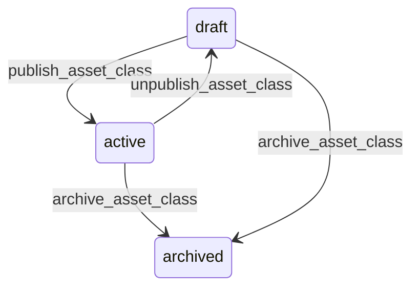

# State machine — Asset Class

*Generated. Edit `_model/capabilities/assets.yaml`, not this file.*

## Transition matrix

| From \\ To | `draft` | `active` | `archived` |
|---|---|---|---|
| **`draft`** | · | `publish_asset_class` | `archive_asset_class` |
| **`active`** | `unpublish_asset_class` | · | `archive_asset_class` |
| **`archived`** | — | — | · |

Any transition marked `—` attempted at runtime returns `E_PRECONDITION`. It is never a silent no-op, because a silent no-op is how an operator believes work was recorded when it was not.

## Stuck-state policy

### `draft`

Threshold: draft_class_stale_days (default 21). Told: the creating principal. Escape hatch: publish or archive. The characteristic confusion is somebody having defined a class with its plans and finding that no new asset picks them up.

### `active`

Two monitored exceptions. (a) A class whose required attributes are missing on more than missing_attribute_alert of its assets (default 0.2) - either the requirement was added after the fact or nobody is filling it in, and both mean the requirement is not real. (b) A class with a depreciation method and assets carrying no acquisition cost, which produces a depreciation schedule of nothing while appearing configured. Told: ops_manager and finance respectively.

