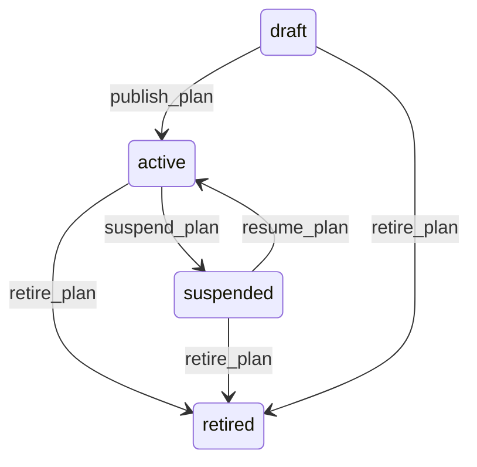

# State machine — Maintenance Plan

*Generated. Edit `_model/capabilities/assets.yaml`, not this file.*

## Transition matrix

| From \\ To | `draft` | `active` | `suspended` | `retired` |
|---|---|---|---|---|
| **`draft`** | · | `publish_plan` | — | `retire_plan` |
| **`active`** | — | · | `suspend_plan` | `retire_plan` |
| **`suspended`** | — | `resume_plan` | · | `retire_plan` |
| **`retired`** | — | — | — | · |

Any transition marked `—` attempted at runtime returns `E_PRECONDITION`. It is never a silent no-op, because a silent no-op is how an operator believes work was recorded when it was not.

## Stuck-state policy

### `draft`

Threshold: draft_plan_stale_days (default 14). Told: the creating principal. Escape hatch: publish or retire. The specific risk is somebody having written a plan in response to a failure and believing it is running.

### `active`

The most valuable monitor here. (a) A plan whose last_generated_at is older than its interval plus its lead time - it should have generated and did not, which means either the generation job is not running or the trigger cannot resolve. Threshold: interval plus lead plus generation_lag_days (default 2). Told: ops_manager AND platform_operator, because the two causes look identical and have different fixes, and this is the case where nobody notices because absent work orders are invisible. (b) A meter-triggered plan whose meter has gone stale, which is the same silence seen from the meter side and is reported once rather than twice by correlating the two. (c) A plan whose generated work is completed later than tolerance on more than overdue_completion_alert of occurrences (default 0.3) - the interval is shorter than the operation can sustain, which is a planning conversation rather than a compliance failure.

### `suspended`

Threshold: plan_suspension_review_days (default 30). Told: the suspending principal and ops_manager. Escape hatch: resume or retire. A suspended plan produces no work and no alerts, so it is invisible by construction and the review is the only thing that surfaces it.

### `retired`

Terminal. Retained, because it is the explanation for work that already exists. Nothing pends.

