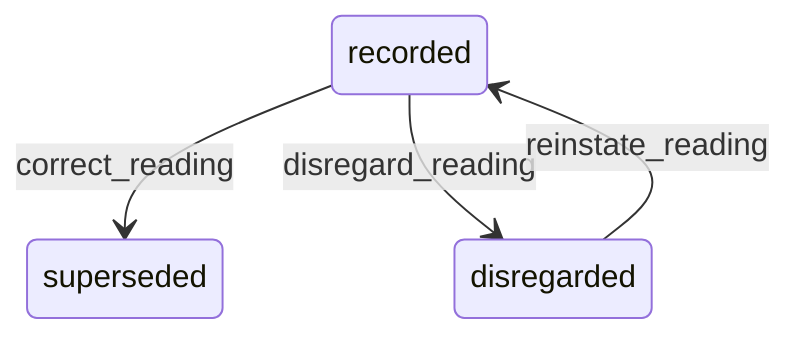

# State machine — Meter Reading

*Generated. Edit `_model/capabilities/assets.yaml`, not this file.*

## Transition matrix

| From \\ To | `recorded` | `superseded` | `disregarded` |
|---|---|---|---|
| **`recorded`** | · | `correct_reading` | `disregard_reading` |
| **`superseded`** | — | · | — |
| **`disregarded`** | `reinstate_reading` | — | · |

Any transition marked `—` attempted at runtime returns `E_PRECONDITION`. It is never a silent no-op, because a silent no-op is how an operator believes work was recorded when it was not.

## Stuck-state policy

### `recorded`

Readings do not pend individually. Two conditions on the series are monitored here. (a) A reading marked implausible_jump or went_backwards that nobody has resolved within reading_review_days (default 7). Told: the custodian and the supervisor, with the previous reading alongside, because the resolution is almost always either a transposed digit or a replaced counter and both are obvious once the two numbers are side by side. (b) A meter with no reading at all for reading_stale_days (default 60) while a usage-based plan depends on it - the plan is silently generating no demand, which is indistinguishable from an asset that needs no work. This is the most dangerous quiet failure in the capability and it is reported to ops_manager.

### `superseded`

Terminal. Retained permanently. The monitored condition is a pattern of corrections concentrated on one asset or one reader, told to ops_manager, because it is either a failing counter or a systematic misreading and both are fixable once seen.

### `disregarded`

Terminal unless reinstated. Retained and visible in the series rather than hidden, because a series with invisible gaps cannot be audited. The monitored condition is a disregard rate above disregard_rate_alert (default 0.05), which usually means the plausibility thresholds are wrong rather than that the readings are.

