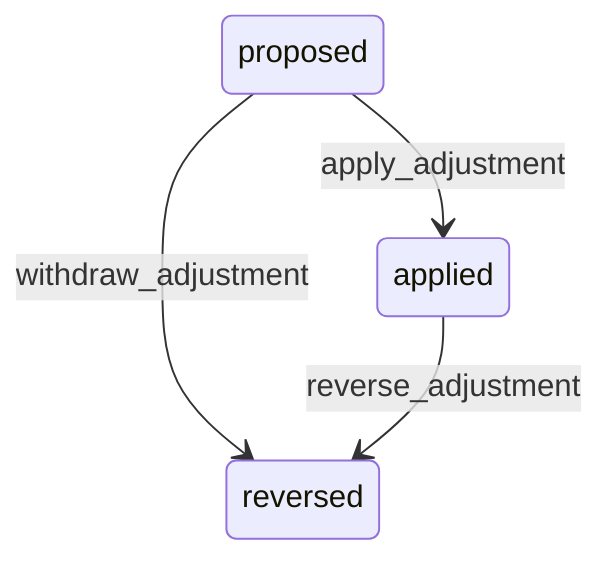

# State machine — Attendance Adjustment

*Generated. Edit `_model/capabilities/attendance_verification.yaml`, not this file.*

## Transition matrix

| From \\ To | `proposed` | `applied` | `reversed` |
|---|---|---|---|
| **`proposed`** | · | `apply_adjustment` | `withdraw_adjustment` |
| **`applied`** | — | · | `reverse_adjustment` |
| **`reversed`** | — | — | · |

Any transition marked `—` attempted at runtime returns `E_PRECONDITION`. It is never a silent no-op, because a silent no-op is how an operator believes work was recorded when it was not.

## Stuck-state policy

### `proposed`

A proposed adjustment is somebody's pay or somebody's invoice held up. Threshold: adjustment_approval_hours (default 24), and immediately if the containing period closes within that window. Told: the approver, then ops_manager. Escape hatch: apply or withdraw. Never auto-applied and never auto-withdrawn - one silently changes somebody's pay and the other silently discards a correction somebody thought they had made.

### `applied`

Terminal in effect. Monitored exception: a pattern rather than an instance - adjustments applied by one principal against one person exceeding adjustment_pattern_alert per period (default 5). Told: ops_manager. This is deliberately a pattern monitor rather than a per-adjustment control, because individually every one of them may be legitimate and collectively they are the shape of both a broken clock-in process and a supervisor altering somebody's hours.

### `reversed`

Terminal. Retained permanently. Nothing pends.

