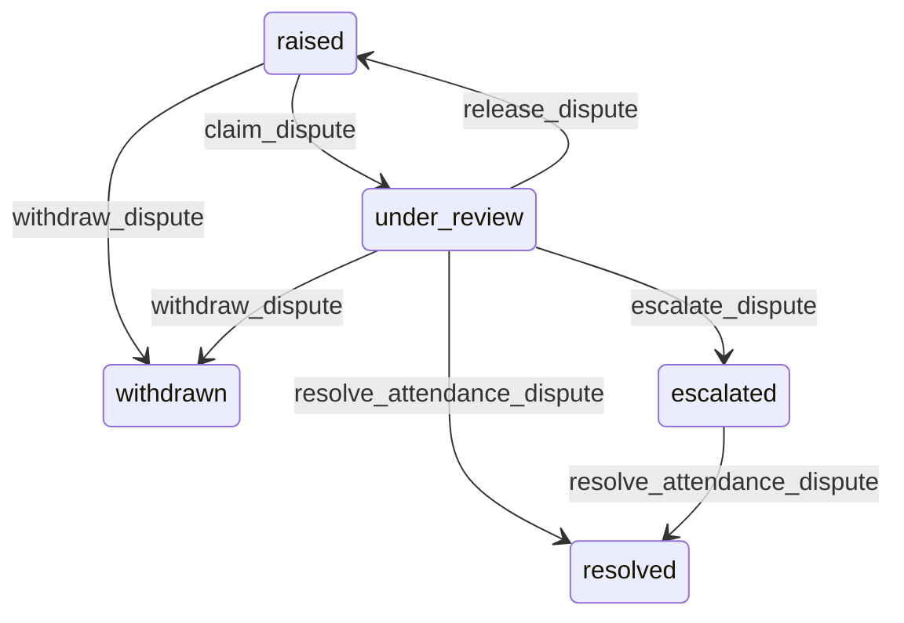

# State machine — Attendance Dispute

*Generated. Edit `_model/capabilities/attendance_verification.yaml`, not this file.*

## Transition matrix

| From \\ To | `raised` | `under_review` | `resolved` | `withdrawn` | `escalated` |
|---|---|---|---|---|---|
| **`raised`** | · | `claim_dispute` | — | `withdraw_dispute` | — |
| **`under_review`** | `release_dispute` | · | `resolve_attendance_dispute` | `withdraw_dispute` | `escalate_dispute` |
| **`resolved`** | — | — | · | — | — |
| **`withdrawn`** | — | — | — | · | — |
| **`escalated`** | — | — | `resolve_attendance_dispute` | — | · |

Any transition marked `—` attempted at runtime returns `E_PRECONDITION`. It is never a silent no-op, because a silent no-op is how an operator believes work was recorded when it was not.

## Stuck-state policy

### `raised`

Threshold: dispute_claim_hours (default 24). Told: every supervisor in scope, then ops_manager. Escape hatch: claim it. An unclaimed dispute is one where the raising party has been told nothing at all, which is worse than being told no.

### `under_review`

Threshold: dispute_resolution_days (default 5). Told: both parties, with the elapsed time, so the person waiting can see that it is moving. Escape hatch: resolve or escalate. The claim itself times out at dispute_claim_timeout_hours (default 48) and returns to raised, so a reviewer who goes on leave does not park somebody's pay indefinitely.

### `resolved`

Terminal. Retained permanently with both positions, the evidence and the reason, because this is the document that answers the same question if it is asked again by a lawyer. Nothing pends.

### `withdrawn`

Terminal. Retained, because a withdrawn dispute and a dispute that never existed are different facts - particularly where a pattern of withdrawals follows a conversation with a supervisor. Nothing pends.

### `escalated`

Threshold: escalated_dispute_days (default 3), then daily to tenant_owner. Told: both parties and the escalation chain. Escape hatch: resolve. There is no further escalation inside Verity and no expiry - an escalated dispute that expires resolves in favour of whoever wrote the record, and that party is never the person disputing it.

