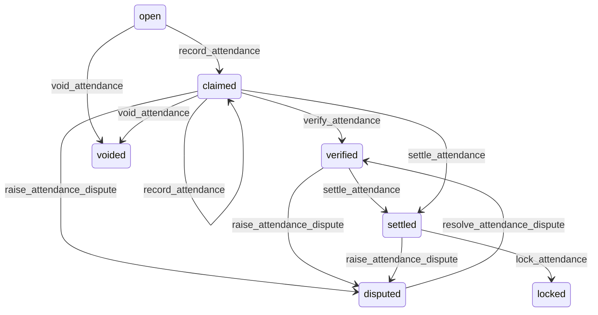

# State machine — Attendance Record

*Generated. Edit `_model/capabilities/attendance_verification.yaml`, not this file.*

## Transition matrix

| From \\ To | `open` | `claimed` | `verified` | `disputed` | `settled` | `locked` | `voided` |
|---|---|---|---|---|---|---|---|
| **`open`** | · | `record_attendance` | — | — | — | — | `void_attendance` |
| **`claimed`** | — | `record_attendance` | `verify_attendance` | `raise_attendance_dispute` | `settle_attendance` | — | `void_attendance` |
| **`verified`** | — | — | · | `raise_attendance_dispute` | `settle_attendance` | — | — |
| **`disputed`** | — | — | `resolve_attendance_dispute` | · | — | — | — |
| **`settled`** | — | — | — | `raise_attendance_dispute` | · | `lock_attendance` | — |
| **`locked`** | — | — | — | — | — | · | — |
| **`voided`** | — | — | — | — | — | — | · |

Any transition marked `—` attempted at runtime returns `E_PRECONDITION`. It is never a silent no-op, because a silent no-op is how an operator believes work was recorded when it was not.

## Stuck-state policy

### `open`

An open record is a commitment whose start time has passed with nothing claimed - somebody has not signed in. Threshold: no_claim_grace_minutes (default 15) past the commitment start. Told: the person first, on push, because the overwhelmingly common cause is that they are present and forgot; then the supervisor at twice the threshold; then the backfill port where one is bound. Escape hatch: claim, void, or let the no-show machinery in scheduling take it. Verity never auto-claims attendance from a person's presence at a location, because auto-claiming means the system asserts on somebody's behalf a fact that will later be used to pay them.

### `claimed`

The most consequential stuck state in the platform: a start claimed and no end. Every hour it persists is an hour accruing against pay and billing that nobody agreed. Threshold: open_shift_alert_hours (default 12), then every hour after. Told: the person, the supervisor, and at max_open_shift_hours (default 24) the ops_manager. Escape hatch: the person ends it, the supervisor ends it with an attested end time, or the system caps it. Capping is configuration and is OFF by default: an automatic cap writes an end time nobody observed, and if that end time is later used to pay somebody less than they worked, the system has silently taken money from them. When a tenant does enable capping, the capped end is written with strength=none and the record is flagged rather than settled.

### `verified`

Steady state until settlement. Monitored exception: verified and unsettled for longer than settlement_lag_days (default 7), which usually means a supervisor is not approving and the person will be paid late. Told: the supervisor, then ops_manager. Escape hatch: settle, or dispute.

### `disputed`

A dispute with money on both sides of it. Threshold: dispute_resolution_days (default 5), escalating to ops_manager then tenant_owner. Told: both parties throughout, and both are shown the same evidence. Escape hatch: resolve with an outcome. Verity never auto-resolves in favour of either party and never times a dispute out - a dispute that expires unresolved resolves in favour of whoever wrote the record, which is always the stronger party.

### `settled`

Bounded by the period close. Monitored exception: settled with a billable outcome that the sink has not acknowledged within outcome_ack_hours (default 4). Told: platform_operator. Unacknowledged billable outcomes are revenue that disappears silently and is only found by reconciling two systems by hand.

### `locked`

Terminal. Immutable. Corrections are adjustment rows referencing it. Retained for the full audit retention period, because attendance is the evidence in any employment or contractual dispute and those arrive years later. Nothing pends.

### `voided`

Terminal. Retained with the reason and the actor, never deleted, because a voided attendance record is precisely the thing somebody will later allege was destroyed. Nothing pends.

