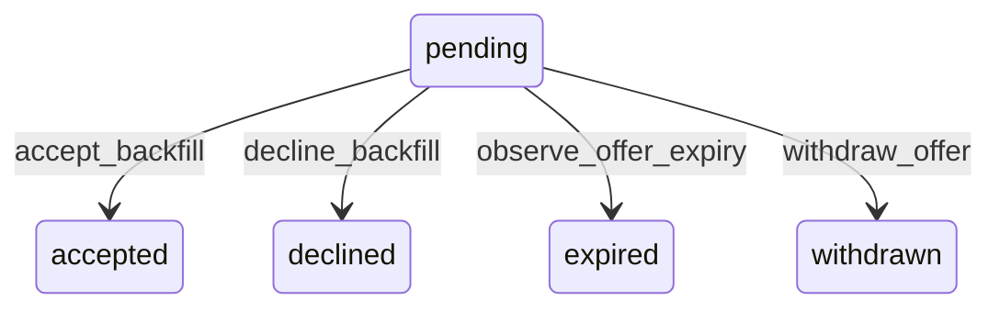

# State machine — Backfill Offer

*Generated. Edit `_model/capabilities/backfill_dispatch.yaml`, not this file.*

## Transition matrix

| From \\ To | `pending` | `accepted` | `declined` | `expired` | `withdrawn` |
|---|---|---|---|---|---|
| **`pending`** | · | `accept_backfill` | `decline_backfill` | `observe_offer_expiry` | `withdraw_offer` |
| **`accepted`** | — | · | — | — | — |
| **`declined`** | — | — | · | — | — |
| **`expired`** | — | — | — | · | — |
| **`withdrawn`** | — | — | — | — | · |

Any transition marked `—` attempted at runtime returns `E_PRECONDITION`. It is never a silent no-op, because a silent no-op is how an operator believes work was recorded when it was not.

## Stuck-state policy

### `pending`

Bounded by expires_at. The monitored exception is an offer with no delivery_confirmed_at after delivery_confirm_seconds (default 120) - the message never arrived, and every second spent waiting for a response to an undelivered offer is lead time thrown away. Told: nobody by notification, because a notification about a failed notification is unreliable by construction. Instead the request advances immediately to the next candidate and the delivery failure is recorded against the channel, so the pattern surfaces in the escalation policy's monthly review.

### `accepted`

Terminal. Retained. Nothing pends beyond the assignment, which the scheduling capability owns.

### `declined`

Terminal. Retained with the reason. The monitored condition is a pattern rather than an instance - a candidate declining more than decline_rate_threshold of offers, or a location whose offers are declined for too_far more than distance_decline_threshold of the time. Both are reported to ops_manager as signals about the offer, the distance or the notice, not primarily about the people. Nothing pends on the individual row.

### `expired`

Terminal. Retained, and counted separately from declines. An expired offer is usually somebody who did not see it, which is a channel problem; a decline is a decision. A model that merged them would attribute a delivery failure to a person.

### `withdrawn`

Terminal. Retained, because the candidate was contacted and may have rearranged around it. Nothing pends.

