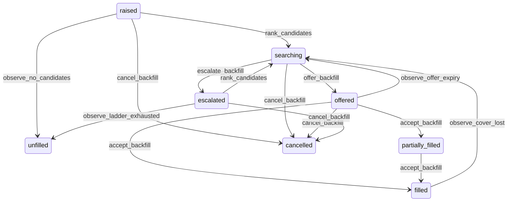

# State machine — Backfill Request

*Generated. Edit `_model/capabilities/backfill_dispatch.yaml`, not this file.*

## Transition matrix

| From \\ To | `raised` | `searching` | `offered` | `filled` | `partially_filled` | `escalated` | `unfilled` | `cancelled` |
|---|---|---|---|---|---|---|---|---|
| **`raised`** | · | `rank_candidates` | — | — | — | — | `observe_no_candidates` | `cancel_backfill` |
| **`searching`** | — | · | `offer_backfill` | — | — | `escalate_backfill` | — | `cancel_backfill` |
| **`offered`** | — | `observe_offer_expiry` | · | `accept_backfill` | `accept_backfill` | — | — | `cancel_backfill` |
| **`filled`** | — | `observe_cover_lost` | — | · | — | — | — | — |
| **`partially_filled`** | — | — | — | `accept_backfill` | · | — | — | — |
| **`escalated`** | — | `rank_candidates` | — | — | — | · | `observe_ladder_exhausted` | `cancel_backfill` |
| **`unfilled`** | — | — | — | — | — | — | · | — |
| **`cancelled`** | — | — | — | — | — | — | — | · |

Any transition marked `—` attempted at runtime returns `E_PRECONDITION`. It is never a silent no-op, because a silent no-op is how an operator believes work was recorded when it was not.

## Stuck-state policy

### `raised`

A raised request that has not begun searching is machinery not running. Threshold: ranking_lag_seconds (default 60) - deliberately in seconds, because the whole capability is a race against lead time. Told: platform_operator, since this is scheduler machinery, AND the dispatcher, since the operational consequence is theirs. Escape hatch: rank manually, or dispatch by hand. This is the shortest threshold in the entire library and it is short on purpose.

### `searching`

Searching with no offer going out means candidates exist and nobody is being asked. Threshold: half the current tier's time budget. Told: the dispatcher. Escape hatch: offer manually. The common cause is a notification channel failing, which is invisible from inside this capability, so the monitor is on the absence of offers rather than on the delivery of them.

### `offered`

Bounded by offer_expiry_minutes, which is tier-configured. The monitored exception is an offer outstanding with less remaining lead time than the offer's own expiry - the ladder will run out before the offer does. In that case the expiry is shortened automatically to fit the remaining lead time, and the shortening is recorded, because an offer that expires after the commitment starts is theatre.

### `filled`

Cover exists and the request is done, but it is not terminal - cover can still be lost before the window starts, which is why observe_cover_lost reopens it at its CURRENT tier rather than at tier zero. The monitored exception is a filled request whose covering assignment is released with less lead time than the fastest tier needs. Told: the dispatcher immediately, not on a timer, because the second failure has less notice than the first and the ladder cannot help. Escape hatch: manual dispatch. Nothing else pends.

### `partially_filled`

Worse than unfilled on a summary screen, because it reads as progress. Same thresholds as searching, and every notification names the SHORTFALL rather than the coverage. Told: the dispatcher and, at critical priority, ops_manager.

### `escalated`

Each tier carries its own time budget and its own audience. The overall stuck condition is the last tier with lead time remaining and nobody accepting. Told: the dispatcher, the location supervisor, then ops_manager, at a cadence that increases as window_start approaches. Escape hatch: widen manually, apply a premium beyond the policy with a recorded authorisation, reduce required_count with a reason, or accept the shortfall. There is no auto-widening beyond the last configured tier, because the last tier is where the tenant has said the cost stops being worth it.

### `unfilled`

A recorded failure, not a queue. It stops escalating on entry, because the moment has passed. Told once, to ops_manager, with the full narrative - lead time, offers, declines, tiers reached and the reason. It appears permanently in coverage reporting and in the location's staffing analysis. Escape hatch: none. The state exists so the failure is not erasable.

### `cancelled`

Terminal. Retained with the cancelling party and the offers already made, because candidates were contacted and possibly rearranged their day. Nothing pends.

