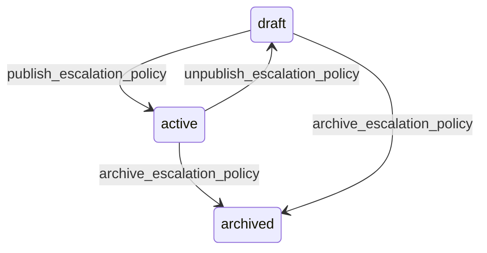

# State machine — Escalation Policy

*Generated. Edit `_model/capabilities/backfill_dispatch.yaml`, not this file.*

## Transition matrix

| From \\ To | `draft` | `active` | `archived` |
|---|---|---|---|
| **`draft`** | · | `publish_escalation_policy` | `archive_escalation_policy` |
| **`active`** | `unpublish_escalation_policy` | · | `archive_escalation_policy` |
| **`archived`** | — | — | · |

Any transition marked `—` attempted at runtime returns `E_PRECONDITION`. It is never a silent no-op, because a silent no-op is how an operator believes work was recorded when it was not.

## Stuck-state policy

### `draft`

Threshold: draft_policy_stale_days (default 14). Told: the creating principal. Escape hatch: publish or archive. The specific danger is that somebody has configured a faster ladder in response to an incident and believes it is running.

### `active`

Two monitored exceptions. (a) A policy whose median time_to_fill exceeds the sum of its own tier budgets - the ladder is not the binding constraint, notification delivery or candidate availability is, and tuning the ladder will do nothing. (b) A policy whose fill rate is below fill_rate_alert (default 0.8) over a rolling month. Told: ops_manager, monthly, with the decline reasons grouped, because the decline reasons are what tell you whether the problem is notice, distance or pay.

