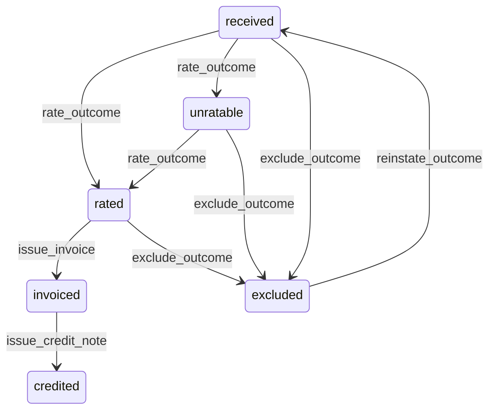

# State machine — Billable Outcome

*Generated. Edit `_model/capabilities/billing.yaml`, not this file.*

## Transition matrix

| From \\ To | `received` | `rated` | `unratable` | `invoiced` | `excluded` | `credited` |
|---|---|---|---|---|---|---|
| **`received`** | · | `rate_outcome` | `rate_outcome` | — | `exclude_outcome` | — |
| **`rated`** | — | · | — | `issue_invoice` | `exclude_outcome` | — |
| **`unratable`** | — | `rate_outcome` | · | — | `exclude_outcome` | — |
| **`invoiced`** | — | — | — | · | — | `issue_credit_note` |
| **`excluded`** | `reinstate_outcome` | — | — | — | · | — |
| **`credited`** | — | — | — | — | — | · |

Any transition marked `—` attempted at runtime returns `E_PRECONDITION`. It is never a silent no-op, because a silent no-op is how an operator believes work was recorded when it was not.

## Stuck-state policy

### `received`

An unrated outcome is revenue that has happened and not yet been quantified. Threshold: rating_lag_hours (default 6). Told: platform_operator, because unrated outcomes usually mean the rating job is not running, AND finance, because the money consequence is theirs and grows hourly. Escape hatch: run rating, or rate manually.

### `rated`

Rated and uninvoiced is revenue waiting to be asked for. Threshold: the tenant's billing cycle plus billing_lag_days (default 3), or uninvoiced_alert_days (default 30) where no cycle is configured. Told: finance. Escape hatch: issue an invoice, or exclude. The monitored case that matters is an outcome older than the contract's own invoicing deadline, where a late invoice may be uncollectable under the agreement.

### `unratable`

The most valuable queue in this capability and the one most often ignored, because it looks like an error log. Threshold: immediate on entry, then a daily digest to finance naming the counterparty, the source capability and the scopes that were searched. Escape hatch: create a rate rule, set an amount manually with a reason, or exclude with a reason. Verity never rates an unratable outcome at zero and never at a neighbouring rate, because both are inventing a price. An outcome that stays unratable past unratable_alert_days (default 7) is escalated to tenant_owner with its value unknown, which is precisely the point.

### `invoiced`

Terminal in outcome terms. Nothing pends here; the invoice's own policies govern.

### `excluded`

Terminal unless reinstated. Exclusions are reported in aggregate each period rather than individually, and where they exceed exclusion_rate_alert of outcomes by value (default 0.02) finance, ops_manager and tenant_owner are told with the reasons grouped and the excluding principals named. Excluding an outcome is the easiest way to make revenue disappear, and the control is visibility rather than prohibition, because genuine exclusions are real and common.

### `credited`

Terminal. Retained permanently. Nothing pends.

