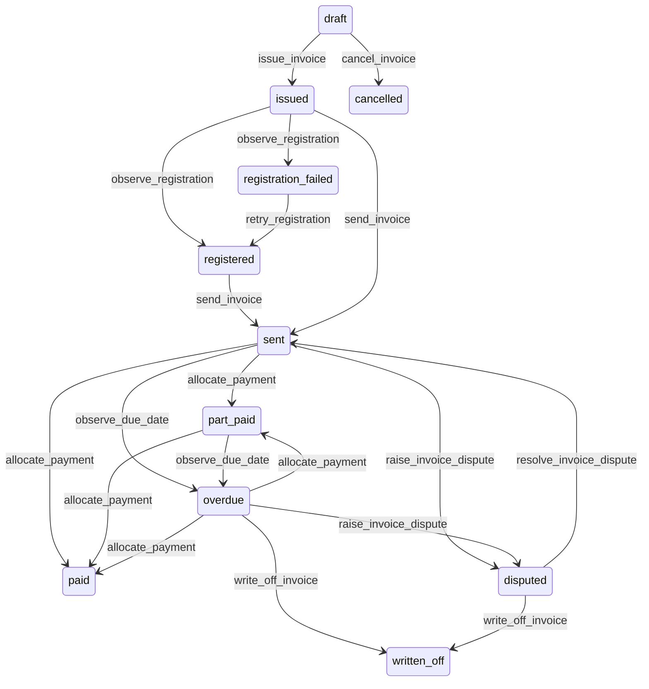

# State machine — Invoice

*Generated. Edit `_model/capabilities/billing.yaml`, not this file.*

## Transition matrix

| From \\ To | `draft` | `issued` | `registered` | `registration_failed` | `sent` | `part_paid` | `paid` | `overdue` | `disputed` | `written_off` | `cancelled` |
|---|---|---|---|---|---|---|---|---|---|---|---|
| **`draft`** | · | `issue_invoice` | — | — | — | — | — | — | — | — | `cancel_invoice` |
| **`issued`** | — | · | `observe_registration` | `observe_registration` | `send_invoice` | — | — | — | — | — | — |
| **`registered`** | — | — | · | — | `send_invoice` | — | — | — | — | — | — |
| **`registration_failed`** | — | — | `retry_registration` | · | — | — | — | — | — | — | — |
| **`sent`** | — | — | — | — | · | `allocate_payment` | `allocate_payment` | `observe_due_date` | `raise_invoice_dispute` | — | — |
| **`part_paid`** | — | — | — | — | — | · | `allocate_payment` | `observe_due_date` | — | — | — |
| **`paid`** | — | — | — | — | — | — | · | — | — | — | — |
| **`overdue`** | — | — | — | — | — | `allocate_payment` | `allocate_payment` | · | `raise_invoice_dispute` | `write_off_invoice` | — |
| **`disputed`** | — | — | — | — | `resolve_invoice_dispute` | — | — | — | · | `write_off_invoice` | — |
| **`written_off`** | — | — | — | — | — | — | — | — | — | · | — |
| **`cancelled`** | — | — | — | — | — | — | — | — | — | — | · |

Any transition marked `—` attempted at runtime returns `E_PRECONDITION`. It is never a silent no-op, because a silent no-op is how an operator believes work was recorded when it was not.

## Stuck-state policy

### `draft`

Threshold: draft_invoice_stale_days (default 2) - short, because a draft invoice holds outcomes out of the next billing run and the counterparty is waiting to be asked. Told: finance. Escape hatch: issue or cancel. Never auto-issued, because an auto-issued invoice is a demand for money nobody checked.

### `issued`

Issued and unregistered is the most consequential state in this capability where registration is required. The document exists, is not legally valid, and has a deadline after which it may never become valid. Threshold: registration_lag_minutes (default 30), then hourly, then at half the remaining time to the deadline, then daily. Told: finance and platform_operator, because the cause is usually an integration failure rather than a data problem. Escape hatch: retry, correct and retry, or cancel and re-issue. Under no circumstances is the document sent to the counterparty described as a tax invoice while in this state.

### `registered`

Transitional; the send policy governs. The monitored exception is a registered document never sent for send_lag_days (default 2), which is an invoice that is legally valid and that nobody has asked for.

### `registration_failed`

Threshold: immediate, then every registration_retry_hours (default 4) until the deadline. Told: finance with the registry's own rejection reason verbatim, because those reasons are specific and actionable and paraphrasing them wastes the only useful information available. Escape hatch: correct and retry, or cancel and re-issue with corrected data. Past the deadline the document is permanently not-tax-valid and is escalated to tenant_owner, because it is a revenue loss rather than an administrative problem.

### `sent`

Steady state until due. The monitored exception is a sent invoice with no delivery confirmation where the channel supports one, for delivery_confirm_days (default 2). An invoice the counterparty never received will not be paid and will be chased, which damages the relationship for no reason.

### `part_paid`

A partial payment usually means either a dispute nobody has raised formally or a deliberate short payment. Threshold: part_paid_review_days (default 7). Told: finance, with the unallocated portion named as an amount rather than a percentage. Escape hatch: chase, raise the dispute formally, or write off the difference.

### `paid`

Terminal. Retained permanently. Nothing pends.

### `overdue`

The collection sequence governs and its steps are configured rather than hardcoded. The stuck condition is an invoice that has exhausted its collection sequence and is still unpaid. Threshold: on sequence exhaustion. Told: finance and tenant_owner, with the counterparty's total exposure across all invoices rather than this one alone, because the decision is about the relationship rather than the document. Escape hatch: escalate externally, write off, or agree a plan. Verity never writes off automatically at any age.

### `disputed`

Threshold: invoice_dispute_days (default 10), escalating to tenant_owner. Told: both the counterparty where a surface is bound and finance. Escape hatch: resolve. No expiry, for the same reason as every other dispute in the platform - an expiring dispute resolves in favour of whoever issued the document.

### `written_off`

Terminal. Retained permanently. The monitored condition is the aggregate: write-offs exceeding writeoff_rate_alert of issued value in a period (default 0.02), told to tenant_owner with the reasons grouped. The aggregate write-off is one of the few honest measures of how well the rest of the platform is working, because it is where unevidenced work, unratable outcomes and unresolved disputes all end up.

### `cancelled`

Terminal, and only reachable from draft. A cancelled draft consumed no document number. Retained so that the outcomes it held can be traced. Nothing pends.

