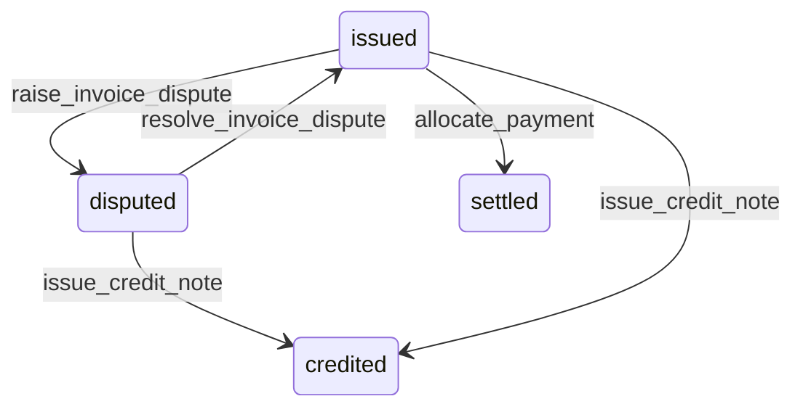

# State machine — Invoice Line

*Generated. Edit `_model/capabilities/billing.yaml`, not this file.*

## Transition matrix

| From \\ To | `issued` | `disputed` | `credited` | `settled` |
|---|---|---|---|---|
| **`issued`** | · | `raise_invoice_dispute` | `issue_credit_note` | `allocate_payment` |
| **`disputed`** | `resolve_invoice_dispute` | · | `issue_credit_note` | — |
| **`credited`** | — | — | · | — |
| **`settled`** | — | — | — | · |

Any transition marked `—` attempted at runtime returns `E_PRECONDITION`. It is never a silent no-op, because a silent no-op is how an operator believes work was recorded when it was not.

## Stuck-state policy

### `issued`

Not a queue in itself; the invoice's own policies govern. The one line-level monitored exception is a line whose evidence references cannot be resolved - the evidence was deleted, or the capability that held it was disabled. Told: finance, because a line that cannot be evidenced is a line that will lose a dispute, and knowing that before the dispute is worth a great deal.

### `disputed`

Threshold: invoice_dispute_days as for the invoice. Told: finance and the counterparty. The specific value of line-level disputes is that the rest of the invoice keeps collecting, and the notification says explicitly which amount is held and which is still due, because a counterparty told only that there is a dispute will pay nothing.

### `credited`

Terminal. Retained. Nothing pends.

### `settled`

Terminal. Retained. Nothing pends.

