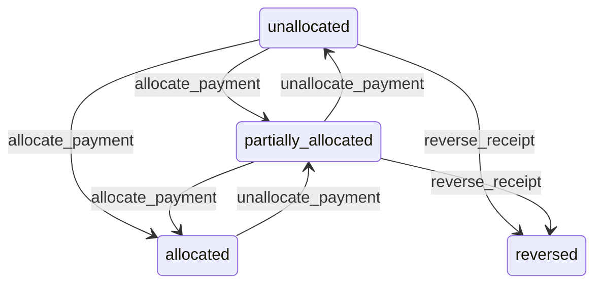

# State machine — Payment Receipt

*Generated. Edit `_model/capabilities/billing.yaml`, not this file.*

## Transition matrix

| From \\ To | `unallocated` | `partially_allocated` | `allocated` | `reversed` |
|---|---|---|---|---|
| **`unallocated`** | · | `allocate_payment` | `allocate_payment` | `reverse_receipt` |
| **`partially_allocated`** | `unallocate_payment` | · | `allocate_payment` | `reverse_receipt` |
| **`allocated`** | — | `unallocate_payment` | · | — |
| **`reversed`** | — | — | — | · |

Any transition marked `—` attempted at runtime returns `E_PRECONDITION`. It is never a silent no-op, because a silent no-op is how an operator believes work was recorded when it was not.

## Stuck-state policy

### `unallocated`

Money in the bank that nobody has matched to anything. Threshold: unallocated_receipt_days (default 3). Told: finance, with the payer narrative and the counterparty's open invoices as candidates. Escape hatch: allocate, or record it as a payment on account against the counterparty. Verity never allocates automatically to the oldest invoice, because that is a guess and it produces an aged debt report nobody believes and disputes that look like non-payment.

### `partially_allocated`

Same threshold as unallocated, applied to the remainder. The specific monitored case is a residual too small to match anything, which accumulates indefinitely; it is reported in aggregate rather than individually, and writing it off is an explicit act.

### `allocated`

Terminal. Retained permanently with its allocations, which are the join between the money and the documents. Nothing pends.

### `reversed`

Terminal. Retained, never deleted, because a reversed receipt that vanished would leave the bank reconciliation short with no explanation. The monitored condition is a pattern - reversals by one principal above a rate - told to tenant_owner.

