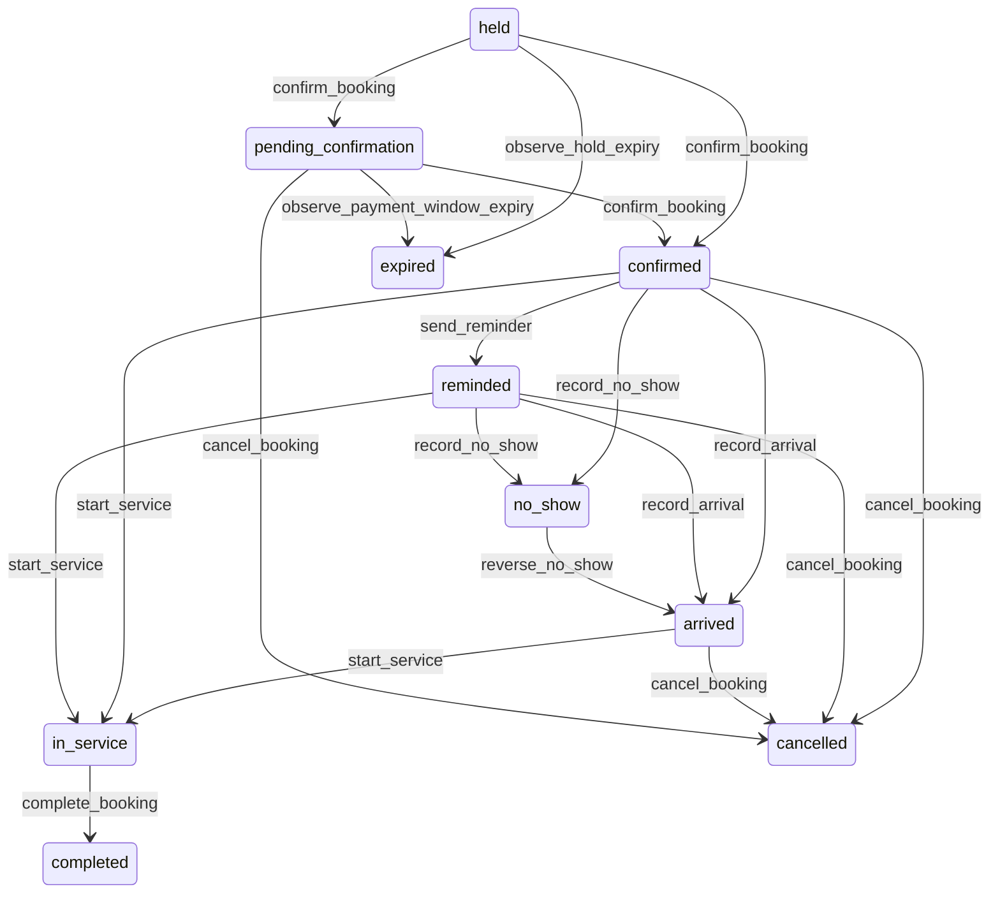

# State machine — Booking

*Generated. Edit `_model/capabilities/booking.yaml`, not this file.*

## Transition matrix

| From \\ To | `held` | `pending_confirmation` | `confirmed` | `reminded` | `arrived` | `in_service` | `completed` | `cancelled` | `no_show` | `expired` |
|---|---|---|---|---|---|---|---|---|---|---|
| **`held`** | · | `confirm_booking` | `confirm_booking` | — | — | — | — | — | — | `observe_hold_expiry` |
| **`pending_confirmation`** | — | · | `confirm_booking` | — | — | — | — | `cancel_booking` | — | `observe_payment_window_expiry` |
| **`confirmed`** | — | — | · | `send_reminder` | `record_arrival` | `start_service` | — | `cancel_booking` | `record_no_show` | — |
| **`reminded`** | — | — | — | · | `record_arrival` | `start_service` | — | `cancel_booking` | `record_no_show` | — |
| **`arrived`** | — | — | — | — | · | `start_service` | — | `cancel_booking` | — | — |
| **`in_service`** | — | — | — | — | — | · | `complete_booking` | — | — | — |
| **`completed`** | — | — | — | — | — | — | · | — | — | — |
| **`cancelled`** | — | — | — | — | — | — | — | · | — | — |
| **`no_show`** | — | — | — | — | `reverse_no_show` | — | — | — | · | — |
| **`expired`** | — | — | — | — | — | — | — | — | — | · |

Any transition marked `—` attempted at runtime returns `E_PRECONDITION`. It is never a silent no-op, because a silent no-op is how an operator believes work was recorded when it was not.

## Stuck-state policy

### `held`

A hold is the shortest-lived state in the platform and the one that causes the most damage when it leaks. Every stuck hold is a slot that appears unavailable and is not booked. Threshold: hold_expiry_minutes (default 10), enforced by the scheduler, and a platform alert where any hold survives more than twice that - which means the expiry sweep is not running and inventory is silently disappearing. Told: platform_operator for the sweep failure. Escape hatch: expire manually. Nobody is notified about an individual hold, because the person holding it is in the middle of a form.

### `pending_confirmation`

Waiting on a payment that may never complete. Threshold: payment_window_minutes (default 15). Told: the booking party once, mid-window, with a resume link. Escape hatch: complete payment, or let it expire. Deliberately NOT held indefinitely - a booking whose payment is pending forever is a slot nobody can have.

### `confirmed`

Steady state until the slot. Two monitored exceptions. (a) A confirmed booking with no underlying assignment for assignment_lag_minutes (default 30) - the person has a confirmation and nobody is allocated to deliver it. Told: the dispatcher, and this is the single most damaging quiet failure in the capability. (b) A confirmed booking whose contact channel has become suppressed or unreachable, meaning no reminder can be sent. Told: staff, so that a telephone call can substitute.

### `reminded`

Bounded by the slot. Monitored exception: a reminder whose delivery was never confirmed. It does not retry on the same channel; it falls through to the next channel in the configured ladder, and where none remains the booking is listed to staff as unreachable. Silently retrying an undeliverable channel spends money and changes nothing.

### `arrived`

The person is present and waiting. Threshold: waiting_alert_minutes (default 15) past starts_at. Told: the assigned resource and the location supervisor. Escape hatch: start the service, or tell the person what is happening. This state exists precisely so that somebody waiting is visible rather than being invisible between confirmed and in_service.

### `in_service`

Bounded by ends_at. Monitored exception: in service beyond overrun_alert_minutes past ends_at (default 30), which delays every subsequent booking on that resource. Told: the location supervisor, with the count of bookings behind it. Escape hatch: complete, or extend explicitly so that subsequent bookings are rescheduled deliberately rather than each running late in turn.

### `completed`

Terminal. The one thing still pending is downstream: where a billable_outcome_sink is bound, a completed booking whose outcome has not been acknowledged within outcome_ack_hours (default 4) is reported to platform_operator. Also monitored is a completed booking with an unapplied or unreleased deposit, told to finance, because a deposit held after the service is delivered is the tenant holding somebody's money for no reason.

### `cancelled`

Terminal. Retained with the reason, the cancelling role, the charge position and the disclosure text that was in force, because that is what a charge dispute is settled with. The monitored exception is a calculated charge never collected or never waived for charge_settlement_days (default 14), told to finance - an uncollected charge and a forgiven one are different facts and leaving it ambiguous means the tenant does not know which policy it is actually running.

### `no_show`

Not a queue. The reversal window stays open for no_show_reversal_hours (default 4) - short, because a late arrival is a same-day event. Monitored condition is a pattern: a location whose no-show rate exceeds no_show_rate_alert (default 0.15) over a month, reported to ops_manager with the reminder delivery rate alongside, because the two together tell you whether the problem is the people or the reminders.

### `expired`

Terminal. A hold or a pending payment that lapsed. Retained, because the rate of expiry against the rate of confirmation is the honest measure of whether a booking flow works, and because an expired payment attempt may still settle late at the provider - in which case the payment arrives with no booking behind it and finance is told rather than the money being silently absorbed. Nothing else pends.

