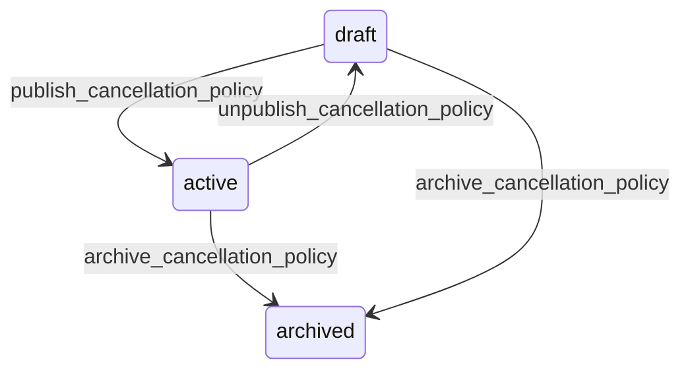

# State machine — Cancellation Policy

*Generated. Edit `_model/capabilities/booking.yaml`, not this file.*

## Transition matrix

| From \\ To | `draft` | `active` | `archived` |
|---|---|---|---|
| **`draft`** | · | `publish_cancellation_policy` | `archive_cancellation_policy` |
| **`active`** | `unpublish_cancellation_policy` | · | `archive_cancellation_policy` |
| **`archived`** | — | — | · |

Any transition marked `—` attempted at runtime returns `E_PRECONDITION`. It is never a silent no-op, because a silent no-op is how an operator believes work was recorded when it was not.

## Stuck-state policy

### `draft`

Threshold: draft_policy_stale_days (default 14). Told: the creating principal. Escape hatch: publish or archive. The specific risk is that somebody has written stricter terms in response to a run of non-attendance and believes they are in force.

### `active`

Monitored exception: a policy with a non-zero charge percentage that has never actually resulted in a charge over charge_never_applied_days (default 90). Either the charge is not being applied when it should be, or it exists only as a deterrent. Both are worth knowing, and the second is a legitimate strategy that should be a deliberate choice rather than an accident. Told: finance, quarterly, advisory.

