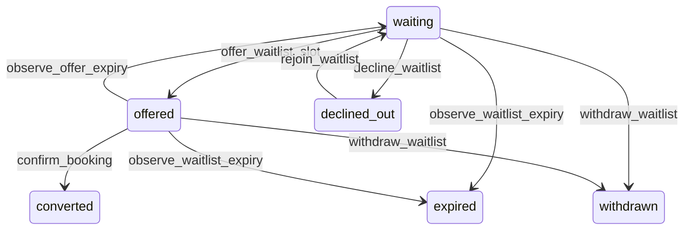

# State machine — Waitlist Entry

*Generated. Edit `_model/capabilities/booking.yaml`, not this file.*

## Transition matrix

| From \\ To | `waiting` | `offered` | `converted` | `declined_out` | `expired` | `withdrawn` |
|---|---|---|---|---|---|---|
| **`waiting`** | · | `offer_waitlist_slot` | — | `decline_waitlist` | `observe_waitlist_expiry` | `withdraw_waitlist` |
| **`offered`** | `observe_offer_expiry` | · | `confirm_booking` | — | `observe_waitlist_expiry` | `withdraw_waitlist` |
| **`converted`** | — | — | · | — | — | — |
| **`declined_out`** | `rejoin_waitlist` | — | — | · | — | — |
| **`expired`** | — | — | — | — | · | — |
| **`withdrawn`** | — | — | — | — | — | · |

Any transition marked `—` attempted at runtime returns `E_PRECONDITION`. It is never a silent no-op, because a silent no-op is how an operator believes work was recorded when it was not.

## Stuck-state policy

### `waiting`

A waiting list that never offers anything is a list of disappointed people. Threshold: an entry waiting past waitlist_silent_days (default 14) with no offer, reported not to the person but to ops_manager as a demand signal - a location with a persistent waiting list has a capacity decision to make and the list is the evidence for it. Escape hatch: none needed at the entry level; the fix is capacity or a shorter expires_at.

### `offered`

Bounded by offer_expires_at, and the held booking behind it is consuming a slot the whole time. Threshold: waitlist_offer_minutes (default 60 where the slot is more than a day away, 15 where it is sooner - because a slot tomorrow morning cannot be held for an hour). Told: the offered party once at half the window. Escape hatch: accept, decline, or let it expire. Never auto-accepted: committing somebody to attend something because they did not reply is a booking that becomes a no-show.

### `converted`

Terminal. Retained, because the conversion rate of a waiting list is what tells a business whether to add capacity. Nothing pends.

### `declined_out`

Threshold: none. The person has been told and may rejoin. Monitored condition is a pattern - a location where more than declined_out_rate_alert of entries end this way (default 0.2), which usually means offers are being made for slots that do not match what people asked for. Told: ops_manager.

### `expired`

Terminal. Retained. The expiry rate against the offer rate is the honest measure of whether a waiting list is working. Nothing pends.

### `withdrawn`

Terminal. Retained, because a withdrawal and an expiry are different facts about demand. Nothing pends.

