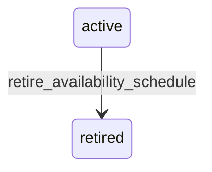

# State machine — Availability Schedule

*Generated. Edit `_model/capabilities/catalog.yaml`, not this file.*

## Transition matrix

| From \\ To | `active` | `retired` |
|---|---|---|
| **`active`** | · | `retire_availability_schedule` |
| **`retired`** | — | · |

Any transition marked `—` attempted at runtime returns `E_PRECONDITION`. It is never a silent no-op, because a silent no-op is how an operator believes work was recorded when it was not.

## Stuck-state policy

### `active`

Not a queue. The monitored exception is a schedule whose windows have made its items unavailable for the whole of the last schedule_dry_days (default 30) - almost always a date range that ended or a timezone error, and it silently removes items from every picker. Told: ops_manager, with the items affected and the reason the schedule is not matching. This is the failure that looks to staff like the catalogue being broken.

### `retired`

Terminal. Retained, because a historical availability decision must remain explicable - a customer asking why they could not order something last Tuesday is answered from here. Nothing pends.

