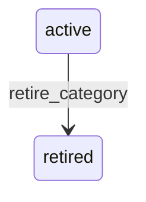

# State machine — Category

*Generated. Edit `_model/capabilities/catalog.yaml`, not this file.*

## Transition matrix

| From \\ To | `active` | `retired` |
|---|---|---|
| **`active`** | · | `retire_category` |
| **`retired`** | — | · |

Any transition marked `—` attempted at runtime returns `E_PRECONDITION`. It is never a silent no-op, because a silent no-op is how an operator believes work was recorded when it was not.

## Stuck-state policy

### `active`

Not a queue. The monitored exception is a category holding no active items for empty_category_days (default 90), which clutters navigation and misleads anybody browsing. Told: ops_manager, quarterly, advisory. A second exception is a category whose default_tax_classification differs from that of most of its items, which is usually a sign the default is wrong and is silently being overridden everywhere.

### `retired`

Terminal. Retained permanently so that a historical report grouped by category still resolves and so that a category-scoped price rule that once applied remains explicable. Nothing pends.

