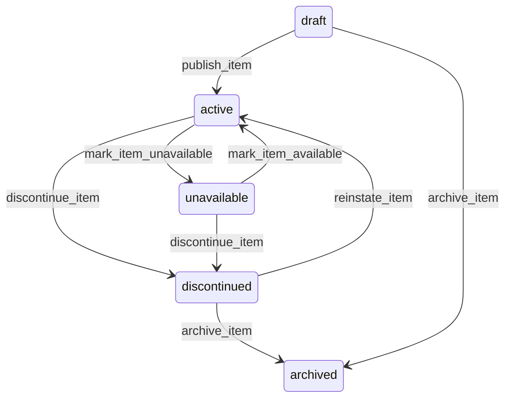

# State machine — Catalog Item

*Generated. Edit `_model/capabilities/catalog.yaml`, not this file.*

## Transition matrix

| From \\ To | `draft` | `active` | `unavailable` | `discontinued` | `archived` |
|---|---|---|---|---|---|
| **`draft`** | · | `publish_item` | — | — | `archive_item` |
| **`active`** | — | · | `mark_item_unavailable` | `discontinue_item` | — |
| **`unavailable`** | — | `mark_item_available` | · | `discontinue_item` | — |
| **`discontinued`** | — | `reinstate_item` | — | · | `archive_item` |
| **`archived`** | — | — | — | — | · |

Any transition marked `—` attempted at runtime returns `E_PRECONDITION`. It is never a silent no-op, because a silent no-op is how an operator believes work was recorded when it was not.

## Stuck-state policy

### `draft`

Threshold: draft_item_stale_days (default 21). Told: the creating principal. Escape hatch: publish or archive. The characteristic failure is a batch of items imported into draft during onboarding and never published, so the tenant believes their catalogue is loaded and every picker is empty.

### `active`

Steady state. Three monitored exceptions. (a) An active sellable item with no resolving price rule for the current date - it can be selected and cannot be priced, which surfaces as an order that cannot be completed. Told: finance and ops_manager, immediately rather than on a timer, because it blocks a transaction. (b) An active item with no transaction for item_dormancy_days (default 180), reported as a candidate for discontinuation, because a picker with four hundred items of which eighty are used is a picker that slows every order. (c) An item whose composition references a component that is itself unavailable or discontinued - the item appears sellable and cannot actually be produced. Told: ops_manager immediately.

### `unavailable`

Meant to be temporary. Threshold: unavailable_review_days (default 14). Told: the principal who marked it and ops_manager. Escape hatch: make available, or discontinue. Where the cause was automatic - a closed availability window or an unavailable component - no review fires while the cause persists, because reminding somebody daily about a seasonal item is how notifications stop being read.

### `discontinued`

Not a queue. The monitored exception is a discontinued item still referenced by an open recurring commitment or contract line. Told: the contract owner and ops_manager, with the count and the commitments, immediately on discontinuation and then weekly. Escape hatch: substitute the replacement, amend the commitment, or reinstate. This is the case where discontinuing an item silently breaks a monthly obligation, and it is discovered on the day of delivery unless it is surfaced here.

