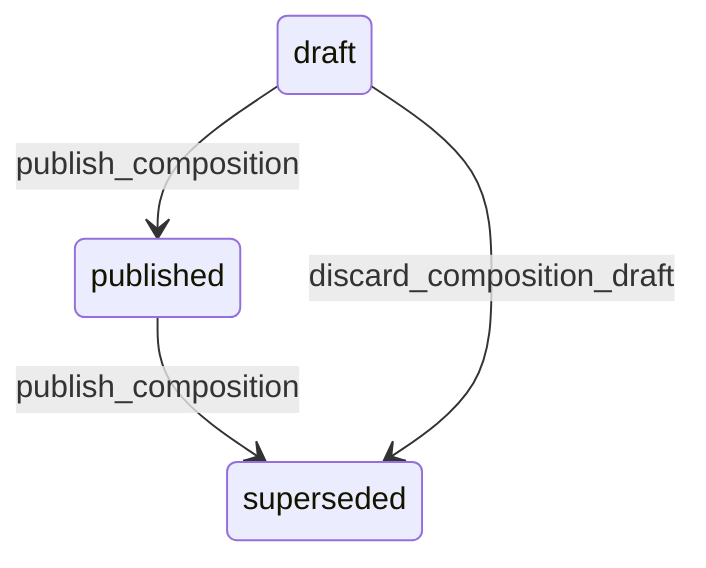

# State machine — Composition

*Generated. Edit `_model/capabilities/catalog.yaml`, not this file.*

## Transition matrix

| From \\ To | `draft` | `published` | `superseded` |
|---|---|---|---|
| **`draft`** | · | `publish_composition` | `discard_composition_draft` |
| **`published`** | — | · | `publish_composition` |
| **`superseded`** | — | — | · |

Any transition marked `—` attempted at runtime returns `E_PRECONDITION`. It is never a silent no-op, because a silent no-op is how an operator believes work was recorded when it was not.

## Stuck-state policy

### `draft`

Threshold: draft_composition_stale_days (default 14). Told: the creating principal. Escape hatch: publish or discard. The specific confusion is acute here - somebody has changed what an item is made of, and until it publishes, every cost figure and every stock movement still uses the old version while the screen shows the new one.

### `published`

Steady state. Two monitored exceptions. (a) A composition whose derived cost has moved by more than cost_drift_alert_percent (default 20) since the parent item's price was last reviewed - the margin has changed and nobody has looked. Told: finance and ops_manager, monthly. This is the single most valuable output of this entity and it is why compositions are worth maintaining at all. (b) A composition containing a component that is discontinued or unavailable, which makes the parent unproducible while it still appears sellable. Told: ops_manager immediately.

### `superseded`

Terminal. Retained permanently, because a historical transaction resolved against it and its cost must remain reproducible during any margin or dispute analysis. Nothing pends.

