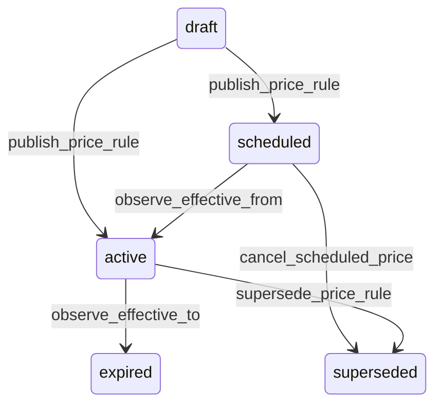

# State machine — Price Rule

*Generated. Edit `_model/capabilities/catalog.yaml`, not this file.*

## Transition matrix

| From \\ To | `draft` | `scheduled` | `active` | `expired` | `superseded` |
|---|---|---|---|---|---|
| **`draft`** | · | `publish_price_rule` | `publish_price_rule` | — | — |
| **`scheduled`** | — | · | `observe_effective_from` | — | `cancel_scheduled_price` |
| **`active`** | — | — | · | `observe_effective_to` | `supersede_price_rule` |
| **`expired`** | — | — | — | · | — |
| **`superseded`** | — | — | — | — | · |

Any transition marked `—` attempted at runtime returns `E_PRECONDITION`. It is never a silent no-op, because a silent no-op is how an operator believes work was recorded when it was not.

## Stuck-state policy

### `draft`

Threshold: draft_price_stale_days (default 7) - short, because an unpublished price change usually has a date attached that is about to pass. Told: the creating principal and finance. Escape hatch: publish or discard. The characteristic failure is a price list prepared for the first of the month and published on the third.

### `scheduled`

Bounded by effective_from. The monitored exception is a scheduled rule whose effective_from has passed while it is still scheduled, meaning the activation sweep is not running and every transaction is being priced at the old rate. Threshold: price_activation_lag_minutes (default 15). Told: platform_operator, because it is machinery, AND finance, because the money consequence is theirs and accumulates every minute.

### `active`

Steady state. Two monitored exceptions. (a) A rule that has never resolved for any transaction over rule_never_applied_days (default 90), which usually means it is shadowed by a higher-precedence rule nobody knew about - the most common pricing complaint and the hardest to diagnose without this monitor. Told: finance, with the shadowing rule named. (b) A rule whose resolved price is more than price_anomaly_multiple away from the list price (default 5), reported once at activation, because a decimal error in a price rule is discovered by a customer.

### `expired`

Terminal. Retained permanently so that a historical transaction can be re-priced identically during a dispute. The monitored exception is an expired rule leaving an item with NO applicable rule, which is the active-item monitor above seen from the other side, and it is reported the moment the expiry lands rather than the next time somebody tries to sell the item.

### `superseded`

Terminal. Retained permanently. Nothing pends.

