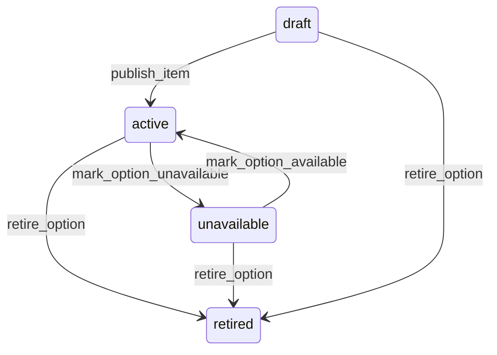

# State machine — Variant and Modifier Option

*Generated. Edit `_model/capabilities/catalog.yaml`, not this file.*

## Transition matrix

| From \\ To | `draft` | `active` | `unavailable` | `retired` |
|---|---|---|---|---|
| **`draft`** | · | `publish_item` | — | `retire_option` |
| **`active`** | — | · | `mark_option_unavailable` | `retire_option` |
| **`unavailable`** | — | `mark_option_available` | · | `retire_option` |
| **`retired`** | — | — | — | · |

Any transition marked `—` attempted at runtime returns `E_PRECONDITION`. It is never a silent no-op, because a silent no-op is how an operator believes work was recorded when it was not.

## Stuck-state policy

### `draft`

Tied to the owning item rather than to its own clock - an unpublished option under a published item is the real problem, and it is caught by the item's publication guard, which refuses to publish a group whose selection rule cannot be satisfied. Told: the creating principal. Escape hatch: publish with the item, or retire.

### `active`

Monitored exception: an option selected on fewer than option_selection_floor of the item's transactions (default 0.01) over a quarter, reported as clutter. Every unused option lengthens the selection screen, and a long selection screen is how an order takes ninety seconds instead of twenty. Advisory only, to ops_manager, quarterly.

### `unavailable`

Threshold: unavailable_review_days (default 14), suppressed while the cause is an active availability schedule. Told: ops_manager. Escape hatch: make available or retire. The specific risk named in the notification is a group whose remaining available options no longer satisfy its own selection rule, which makes the parent item unorderable while still appearing active.

### `retired`

Terminal. Retained permanently so that a historical line naming this option still resolves to what was actually chosen and what it cost. Nothing pends.

