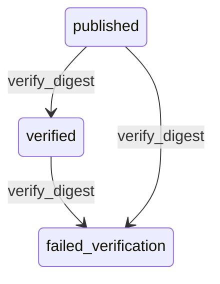

# State machine — Audit Digest

*Generated. Edit `_model/capabilities/core_audit.yaml`, not this file.*

## Transition matrix

| From \\ To | `published` | `verified` | `failed_verification` |
|---|---|---|---|
| **`published`** | · | `verify_digest` | `verify_digest` |
| **`verified`** | — | · | `verify_digest` |
| **`failed_verification`** | — | — | · |

Any transition marked `—` attempted at runtime returns `E_PRECONDITION`. It is never a silent no-op, because a silent no-op is how an operator believes work was recorded when it was not.

## Stuck-state policy

### `published`

A digest that is published but never verified means nobody has checked the chain. Threshold: verification_lag_hours (default 24). Told: platform_operator. Escape hatch: run verification manually. Verification is deliberately a separate scheduled job from publication and ideally runs under different credentials, because a single process that both publishes and verifies is checking its own homework.

### `verified`

Steady state. Re-verified on a rolling cadence - full_chain_verify_days (default 7) for the recent window, and the entire chain on a monthly cadence. A digest that has not been re-verified within twice its cadence is reported as unverified rather than assumed good, because "it verified once, months ago" is a weaker statement than most people reading a green tick will assume.

### `failed_verification`

This is an incident, not a queue. There is no timeout and no escalation ladder, because escalation is immediate and to the top on entry. The state persists until a human closes the incident with a recorded finding. The escape hatch is deliberately manual and deliberately effortful.

