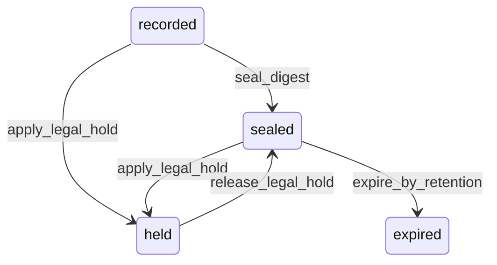

# State machine — Audit Record

*Generated. Edit `_model/capabilities/core_audit.yaml`, not this file.*

## Transition matrix

| From \\ To | `recorded` | `sealed` | `held` | `expired` |
|---|---|---|---|---|
| **`recorded`** | · | `seal_digest` | `apply_legal_hold` | — |
| **`sealed`** | — | · | `apply_legal_hold` | `expire_by_retention` |
| **`held`** | — | `release_legal_hold` | · | — |
| **`expired`** | — | — | — | · |

Any transition marked `—` attempted at runtime returns `E_PRECONDITION`. It is never a silent no-op, because a silent no-op is how an operator believes work was recorded when it was not.

## Stuck-state policy

### `recorded`

A row that is never sealed cannot be independently verified, so a backlog here is a loss of evidentiary quality rather than a loss of data. Threshold: any row unsealed for longer than four digest intervals (digest_interval_minutes, default 60). Told: platform_operator, because digest publication is platform machinery and a tenant can do nothing about it. Escape hatch: run the digest job manually. The audit remains readable and admissible-as-internal-record throughout; what is lost while the backlog persists is the ability to prove the chain to a third party.

### `sealed`

The normal steady state for the whole retention period. The monitored exception is a verification failure - a periodic re-verification sweep recomputes hashes over a sample and over the full chain on a slower cadence. A mismatch is the single highest-severity alert the platform can raise, goes to platform_operator and to the affected tenant_owner simultaneously, and is deliberately not suppressible or snoozable. Escape hatch: none. A hash mismatch is not a thing to be dismissed; it is either a storage fault or an intrusion, and both require a human.

### `held`

A legal hold with no end is how an audit archive becomes permanently unmanageable and how a data-subject erasure request becomes impossible to answer. Threshold: hold_review_days (default 180). Told: the principal who applied the hold and tenant_owner. Escape hatch: release_legal_hold. Verity never auto-releases a hold - an automatic release is a spoliation risk - but it never stops asking either.

### `expired`

Terminal. The tombstone is retained permanently so the hash chain still verifies across the gap; a chain with a hole in it cannot be distinguished from a chain somebody cut. Nothing pends.

