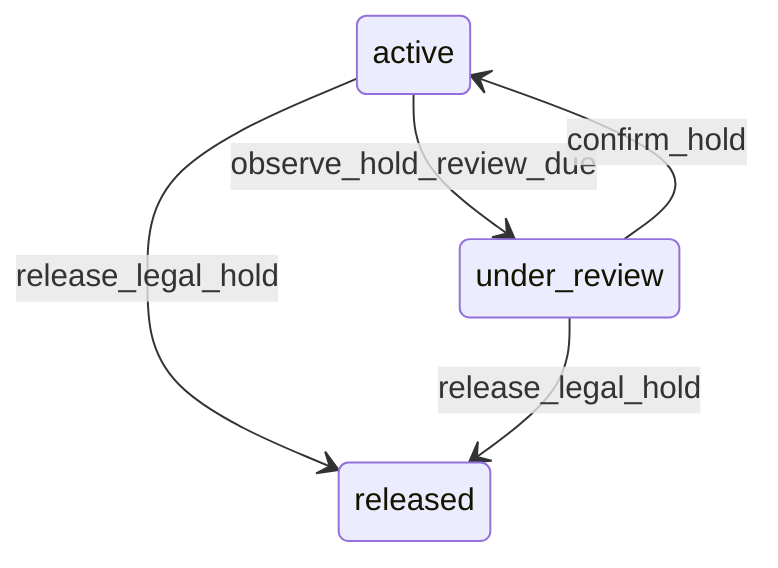

# State machine — Legal Hold

*Generated. Edit `_model/capabilities/core_audit.yaml`, not this file.*

## Transition matrix

| From \\ To | `active` | `under_review` | `released` |
|---|---|---|---|
| **`active`** | · | `observe_hold_review_due` | `release_legal_hold` |
| **`under_review`** | `confirm_hold` | · | `release_legal_hold` |
| **`released`** | — | — | · |

Any transition marked `—` attempted at runtime returns `E_PRECONDITION`. It is never a silent no-op, because a silent no-op is how an operator believes work was recorded when it was not.

## Stuck-state policy

### `active`

Reviewed at hold_review_days (default 180), which moves it to under_review rather than releasing it. Told: the applier and tenant_owner. There is no automatic release at any threshold.

### `under_review`

A review nobody answers is the normal failure. Threshold: hold_review_grace_days (default 30), after which it escalates to tenant_owner weekly and appears in the tenant health surface. Escape hatch: confirm_hold or release_legal_hold. The hold remains fully in force throughout - an unanswered review never weakens the hold, because the consequence of accidental deletion is unrecoverable and the consequence of over-retention is storage cost.

### `released`

Terminal. The hold is over and the records it covered have returned to their derived retention class, which means the retention job may now expire them. Nothing pends. The row is retained permanently as the record of what was held, by whom, for which matter and for how long, because that is what a later dispute asks about.

