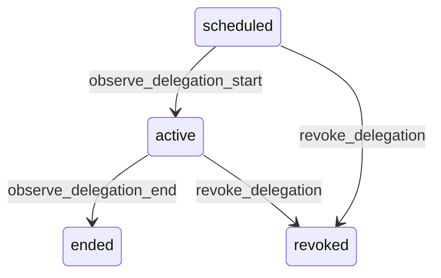

# State machine — Delegation

*Generated. Edit `_model/capabilities/core_authorization.yaml`, not this file.*

## Transition matrix

| From \\ To | `scheduled` | `active` | `ended` | `revoked` |
|---|---|---|---|---|
| **`scheduled`** | · | `observe_delegation_start` | — | `revoke_delegation` |
| **`active`** | — | · | `observe_delegation_end` | `revoke_delegation` |
| **`ended`** | — | — | · | — |
| **`revoked`** | — | — | — | · |

Any transition marked `—` attempted at runtime returns `E_PRECONDITION`. It is never a silent no-op, because a silent no-op is how an operator believes work was recorded when it was not.

## Stuck-state policy

### `scheduled`

A delegation scheduled and then forgotten activates at a moment nobody is expecting. Threshold: any delegation scheduled to start more than max_delegation_lead_days ahead (default 90) is refused at creation rather than monitored, because the delegator's own permissions will very likely have changed by then. Between now and that limit, the delegate is reminded 24h before start. Told: both parties. Escape hatch: revoke_delegation.

### `active`

Bounded by ends_at, which is mandatory. The monitored exception is a delegation being exercised far more than the cover implies - more than delegation_activity_alert actions in a day (default 200) - which usually means a cover arrangement has silently become the operating model. Told: tenant_admin, once per delegation, with a suggestion to make it a role binding so it appears in the access review. No automatic action, because the work is legitimate and blocking it mid-shift would be worse than the governance problem it solves.

### `ended`

Terminal in effect. Retained for the audit retention period so that actions taken under it remain attributable to both the delegate and the delegator, which is the whole point of recording a delegation rather than temporarily editing a role. Nothing pends.

### `revoked`

Terminal. Retained for the audit retention period, for the same reason as an ended delegation - actions taken under it must remain attributable to both parties. Nothing pends.

