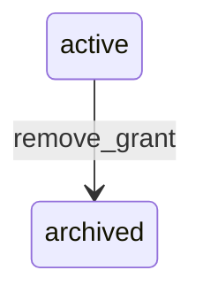

# State machine — Permission Grant

*Generated. Edit `_model/capabilities/core_authorization.yaml`, not this file.*

## Transition matrix

| From \\ To | `active` | `archived` |
|---|---|---|
| **`active`** | · | `remove_grant` |
| **`archived`** | — | · |

Any transition marked `—` attempted at runtime returns `E_PRECONDITION`. It is never a silent no-op, because a silent no-op is how an operator believes work was recorded when it was not.

## Stuck-state policy

### `active`

A grant cannot be stuck as such, but two conditions on an active grant are operational exceptions. (a) A grant referencing an entity_key or field that is not in the resolved tenant manifest - a dangling grant. Detected by the manifest reconciliation sweep, reported as drift, never silently ignored, because a dangling grant is usually the residue of a capability being disabled and it will start granting again the moment that capability is re-enabled. (b) A grant whose condition_expression has failed evaluation more than expression_failure_threshold times in 24h (default 100). A failing expression must NOT be treated as false and must not be treated as true - the request fails closed with E_INTERNAL and the tenant_admin plus platform_operator are told, because a permission expression that is neither true nor false is the exact situation kernel K16 mandates explicit three-valued handling for.

