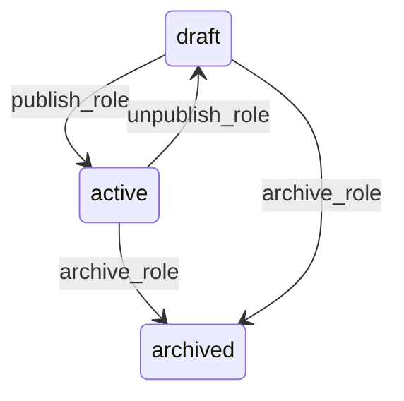

# State machine — Role

*Generated. Edit `_model/capabilities/core_authorization.yaml`, not this file.*

## Transition matrix

| From \\ To | `draft` | `active` | `archived` |
|---|---|---|---|
| **`draft`** | · | `publish_role` | `archive_role` |
| **`active`** | `unpublish_role` | · | `archive_role` |
| **`archived`** | — | — | · |

Any transition marked `—` attempted at runtime returns `E_PRECONDITION`. It is never a silent no-op, because a silent no-op is how an operator believes work was recorded when it was not.

## Stuck-state policy

### `draft`

A role left in draft is a permission change somebody started and abandoned, and it is invisible in every list that matters because draft roles are excluded from the grant picker. Threshold: draft_role_stale_days (default 14). Told: the creating principal, then tenant_admin. Escape hatch: publish or archive. Verity never auto-publishes a draft role — publishing is a security decision and an abandoned draft is evidence that somebody was unsure, which is the worst possible reason to proceed automatically.

### `active`

Two monitored degenerate forms. (a) An active role with zero bindings for unbound_role_days (default 90) is reported to tenant_admin as a candidate for archival, because unused roles are how a permission review becomes unreadable. (b) An active role whose source_capability_version is behind the installed capability version AND whose grants reference an entity, action or field that no longer exists. This is reported as a BROKEN override per the composition model's upgrade semantics, blocks the upgrade in staging, and is never silently dropped. Escape hatch for (b) - repair the grant, or explicitly accept the narrowing with a recorded reason.

