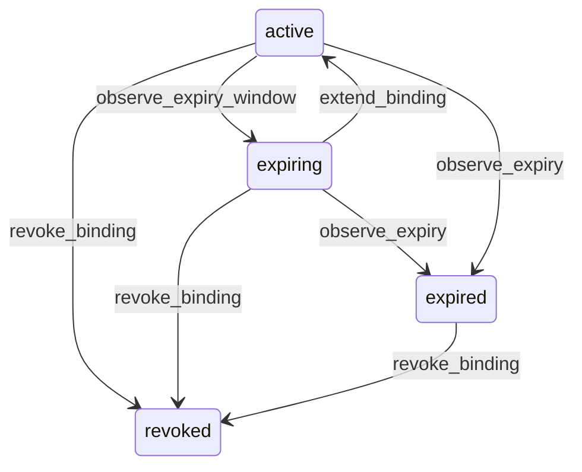

# State machine — Role Binding

*Generated. Edit `_model/capabilities/core_authorization.yaml`, not this file.*

## Transition matrix

| From \\ To | `active` | `expiring` | `expired` | `revoked` |
|---|---|---|---|---|
| **`active`** | · | `observe_expiry_window` | `observe_expiry` | `revoke_binding` |
| **`expiring`** | `extend_binding` | · | `observe_expiry` | `revoke_binding` |
| **`expired`** | — | — | · | `revoke_binding` |
| **`revoked`** | — | — | — | · |

Any transition marked `—` attempted at runtime returns `E_PRECONDITION`. It is never a silent no-op, because a silent no-op is how an operator believes work was recorded when it was not.

## Stuck-state policy

### `active`

A permanent binding is normal. The monitored exception is a binding that has never been exercised - the principal has never successfully performed any action the role uniquely grants - for unused_binding_days (default 90). Told: tenant_admin, as a quarterly access-review list rather than a notification, because access review is a periodic activity and turning it into a stream of alerts guarantees it is ignored. No automatic revocation. Verity does not remove someone's access because they have not used it, since the day they need it is exactly the day it must work.

### `expiring`

Bounded by construction - expires_at is set. The exception is nobody responding to the warning. Threshold: binding_expiry_warning_days (default 7) with a second reminder at 1 day. Told: the grantee and the granting principal, escalating to tenant_admin at expiry. Escape hatch: extend_binding, or let it lapse deliberately. Verity never auto-extends. A binding that silently renews itself is not a time-boxed grant; it is a permanent grant with extra steps.

### `expired`

A lapsed binding should be resolved, not left. It confers nothing, so there is no security exposure, but a person whose cover expired mid-shift is an operational problem that looks to them like the software breaking. Threshold - expired bindings older than expired_binding_review_days (default 30) appear in the access review with the count of permission denials that binding would have prevented, which is the number that tells an administrator whether the lapse mattered. Escape hatch - re-grant a new binding, or revoke to close it out. A new grant is a new row; expired bindings are never resurrected, so the access history reads as two distinct periods.

### `revoked`

Terminal. The binding confers nothing and nothing pends. Retained permanently so an audit row naming this binding as the authority under which an action was taken still resolves to what the binding actually granted. Re-granting is always a new row.

