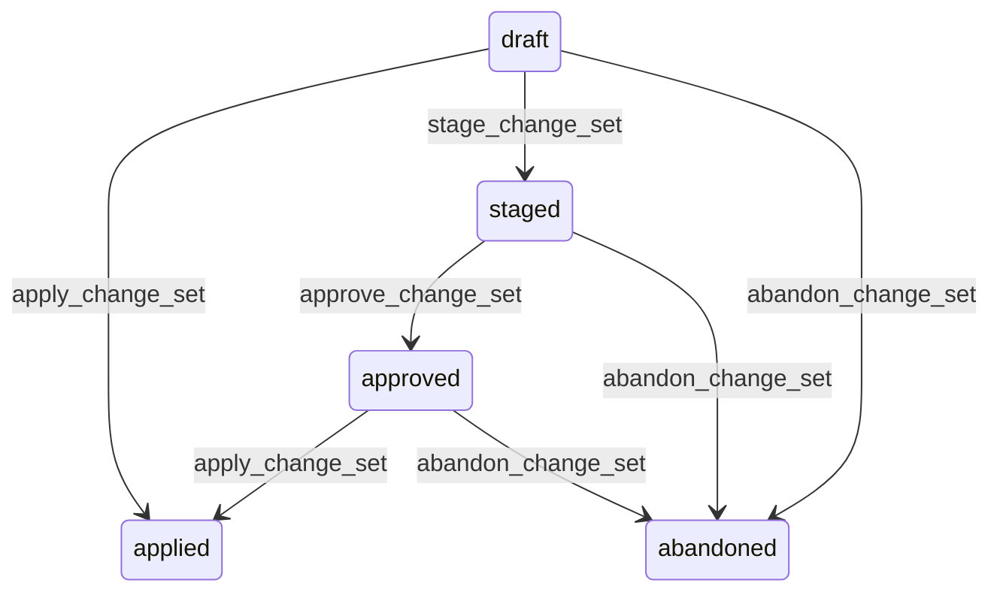

# State machine — Configuration Change Set

*Generated. Edit `_model/capabilities/core_configuration.yaml`, not this file.*

## Transition matrix

| From \\ To | `draft` | `staged` | `approved` | `applied` | `abandoned` |
|---|---|---|---|---|---|
| **`draft`** | · | `stage_change_set` | — | `apply_change_set` | `abandon_change_set` |
| **`staged`** | — | · | `approve_change_set` | — | `abandon_change_set` |
| **`approved`** | — | — | · | `apply_change_set` | `abandon_change_set` |
| **`applied`** | — | — | — | · | — |
| **`abandoned`** | — | — | — | — | · |

Any transition marked `—` attempted at runtime returns `E_PRECONDITION`. It is never a silent no-op, because a silent no-op is how an operator believes work was recorded when it was not.

## Stuck-state policy

### `draft`

Threshold: draft_change_set_stale_days (default 14). Told: the creating principal. Escape hatch: apply or abandon. A draft change set is harmless but it holds a staging environment's worth of intent that somebody will eventually apply without remembering why.

### `staged`

A staged change set is occupying the tenant's staging environment, and a second change set cannot be staged behind it. This makes it a queue head, which is the classic stuck state. Threshold: staged_change_set_stale_days (default 7). Told: the creating principal, then tenant_owner. Escape hatch: approve, abandon, or force-evict with a recorded reason so a second change set can proceed. Verity never silently evicts, because evicting somebody else's staged work at 9am on a Monday is how a team stops using staging.

### `approved`

Approved and unapplied is the most dangerous of these states, because everybody involved believes the change is live. Threshold: approved_unapplied_hours (default 48). Told: the approver and the creator, escalating to tenant_owner. Escape hatch: apply or abandon. Approval expires at approval_validity_days (default 14), after which the set returns to staged and must be re-approved, because an approval given against a two-week-old staging run is an approval of something else.

### `applied`

Terminal. The set has landed and its member values are live. Nothing pends. The one follow-on obligation is the post-deploy reconciliation against the tenant manifest, which is tracked on the reconciliation run rather than on the change set, so that a failed reconciliation does not make an applied change look unapplied.

### `abandoned`

Terminal. Retained rather than deleted, so that 'we tried this and stopped' is recoverable. That is more useful during an incident review than a gap. Nothing pends.

